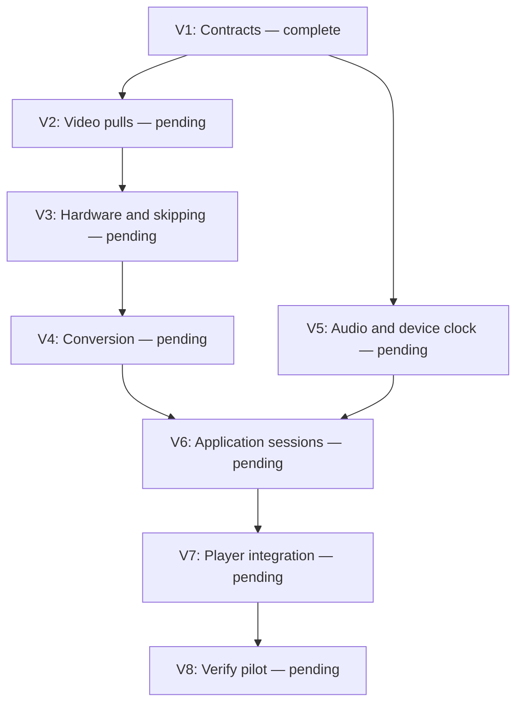

# Player-first pull playback with video3

## Goal and scope

Prove synchronous pull decoding and application-owned, audio-master playback in
the smaller debug player before refactoring the editor. Create a new
`VideoBackend` under `rust/src/video3/` and migrate `rust/src/player/` to it.
This is a new implementation: do not import, call, re-export, include, move, or copy
implementation code from `video2`. Do not depend on its types, helpers, rendering,
workers, feature flags, or tests. Use FFmpeg, CPAL, GPUI, and existing platform
libraries directly. The old backend and editor remain operational and untouched.

Preserve the player's video-file opening/autoplay, optional audio, play/pause,
scrubbing and resume rules, arrow stepping, mute/volume, fullscreen, history,
thumbnails, and inspector. No editor/timeline migration, timeline mixing, CLI
migration, new audio-only player workflow, or unrelated history cleanup in this
phase. Shared playback controls may remain if they do not depend on a backend.
No implementation starts until instructed. No new tests; never add player tests.

## Architecture and public contracts

### Synchronous backend

- `video3::VideoBackend::open(path)` synchronously opens metadata, a video decoder,
  and an optional audio decoder. Video is required for this player's workflow.
  Each decoder owns its own demux context and native resources. Expose owned
  parts for the application to place on independent execution lanes; do not hide
  both streams behind one mutex or require concurrent mutable access to a facade.
- Video operations are synchronous `next_frame() -> Result<Option<VideoFrame>>`
  and `seek(position) -> Result<VideoFrame>`. `VideoFrame` owns native
  `ffmpeg_next::frame::Video`, normalized presentation time, optional duration,
  and required color/rotation metadata. Packet pumping, reordering, and draining
  are internal; `None` means drained EOF, not EAGAIN.
- Audio operations are synchronous `next_samples() -> Result<Option<AudioSamples>>`
  and `seek(position) -> Result<()>`. Return owned PCM, starting media time,
  sample rate, channel layout, and sample-frame count. Resample to the selected
  device configuration. Drain the resampler at EOF; trim pre-target samples after
  seeking. Normalize both streams against the same media origin, preserving offsets.
- Video seek chooses the nearest frame bracketing the requested time, earlier on
  ties. Retain necessary lookahead so the next pull continues after the selected
  frame. Clamp to the beginning/last available frame; empty video is an error.
  For arrow stepping, preserve the current average-frame-interval target behavior;
  do not introduce a new variable-rate stepping policy during this refactor.
- Backend modules contain no playback tasks, application worker spawning, command
  channels, presentation clock, shared current-frame state, or UI callbacks.
  Codec-internal parallelism remains allowed. Native ownership stays explicit;
  do not add unsafe `Send`/`Sync` implementations to move contexts between threads.

### Hardware and image preparation

- Implement hardware selection independently through FFmpeg's hardware decoding
  APIs. On macOS, attempt VideoToolbox when the codec exposes a compatible hardware
  configuration; verify the actual selected frame format. Other inputs/platforms
  retain software decoding. Hardware availability must never be inferred merely
  from successful creation of a generic decoder.
- If hardware initialization fails, open a fresh software decoder. If hardware
  decoding fails later, reopen in software and retry the requested media position
  once, suppressing duplicate previously returned frames during sequential playback.
  Expose the selected mode and fallback reason for performance diagnostics.
- Keep native frames through selection. Seek/catch-up avoids image conversion for
  discarded frames. Implement codec-safe intermediate-frame skipping only when
  target/bracketing frames and reference dependencies remain intact. Never enable
  global NONREF/KEYFRAME-only output for accurate seeks. Where safe decode skipping
  cannot be proven, decode dependencies and skip only conversion/output work.
- Use a separate synchronous converter with reusable scaling resources. Transfer
  hardware frames to CPU-readable frames when needed, then convert selected frames
  to RGBA and apply color range/matrix and rotation. Prepare GPUI's required BGRA
  image on the background lane. Reconfigure on actual format/dimension changes.
  For this pilot, use ordinary GPUI image rendering; zero-copy native-surface
  rendering is deferred and its transfer/conversion cost must be measured.

### Application concurrency and ownership

- Put execution adapters, session control, audio device output, and playback tasks
  in the player application layer. Use GPUI foreground tasks for coordination and
  updates, background execution for blocking work, and async channels for replies
  and backpressure. Do not introduce a second async runtime just for this pilot.
- One serial video lane owns demux/decoder/converter; one serial audio lane owns
  demux/decoder/resampler when present. Open, use, and drop resources on their lane.
  Opening returns metadata and independent async handles, not native contexts to
  GPUI. Each lane waits for requested operations and has no presentation scheduler.
  Do not spawn an OS thread per frame or poll empty queues.
- One player session controller starts concurrent audio-refill and video tasks.
  Share one session identity/request revision and playback state. Store only the
  prepared displayed frame, UI/control snapshot, and session handle in the entity.
  Permit one active video operation and one prepared lookahead frame. Bound pending
  decode work, coalesce seeks to the newest pending target, and carry data in messages.
- A session/revision accompanies prepared images and audio blocks. Discard stale
  results after seeking, source replacement, or closure, including immediately
  before UI publication and audio enqueue/consumption. Stopping an await does not
  interrupt an active FFmpeg call; retire resources on their worker after it returns.
  No worker joins or native resource destruction on the GPUI thread.

### Audio clock and presentation

- Audio output exposes bounded async `enqueue(samples)`, `played_position()`, and
  asynchronous progress/state notifications. Its CPAL callback consumes prepared
  PCM, applies gain/mute, and records timing without decoding, blocking waits,
  allocations for media work, or calls into application/UI code.
- Bound queued PCM by sample duration: initially 200 ms maximum, with 100 ms startup/
  resume priming (or remaining samples at EOF). Split larger decoded blocks when
  enqueuing. Audio refill proceeds independently while video is decoding.
- Played position comes from timestamped samples actually consumed and device
  presentation timing, accounting for latency once. Queuing samples does not advance
  the clock. Muting preserves clock advancement; pause and underrun freeze media
  advancement. Output silence on underrun. Timestamp gaps within a stream are media
  silence and advance media time; distinguish them from lack of decoded data.
- Video prepares ahead, compares PTS to this audio clock, then waits interruptibly
  and rechecks before presentation. Ahead frames wait; due frames display; stale
  candidates are discarded before conversion where possible. Decode speed must not
  change playback rate. A stopped clock waits for progress/commands, not a busy loop.
- Without audio, use absolute PTS deadlines against an application monotonic anchor.
  If audio drains before video ends, continue from that final position with a
  monotonic anchor. If video ends first, hold the last frame until audio drains.
  Device errors stop playback and are reported, not hidden by a clock switch.
- The controller coordinates seeks: advance revision, suspend output/presentation,
  invalidate application audio queues and video results, seek both streams, prime
  audio and the target image, then resume according to the previous play state.
  Device-submitted samples may persist for device latency; do not claim they can
  be retracted. A paused seek displays immediately without awaiting audio progress.
  Arrow stepping pauses playback and presents the requested target. A newer seek
  supersedes preparation; errors prevent a partial restart.
- Business logic returns errors; the session boundary logs once with `{error:?}`
  and publishes UI status. Retain the last successful image during loading/failure.

### Concurrent application sketch

These handles are application adapters around synchronous decoders. The session
starts both tasks together; this sketch omits required controls and late-frame logic.

```rust
// Audio refill task, when audio exists.
while let Some(samples) = audio_worker.next_samples().await? {
    audio_output.enqueue(samples).await?;
}

// Concurrent video preparation/presentation task.
while let Some(prepared) = video_worker.prepare_next_frame().await? {
    wait_until_due(&playback_clock, prepared.timestamp).await?;
    player.update_preview(prepared.image);
}
```

## Steps and review checkpoints

Progress: **1/8 active steps complete**. Current: V1 complete, awaiting review
before V2. Later steps retain their explicit review checkpoints.
Blockers: none. Update checkbox, evidence, progress, and graph immediately after
each step; pause for explicit review before the next step unless waived by the user.

- [x] **V1 — Establish the independent contracts** (complete; no dependencies).
  Add `video3` module/feature scaffolding, synchronous decoder/result types, and
  player application execution/session interfaces. Keep the player using its current
  path until V7. A dedicated `video3` Cargo feature enables its direct dependencies;
  it must not enable old backend features. Establish control flow before filling
  lower-level bodies; intermediate scaffolding may be incomplete.
  Evidence: interface/feature review confirms ownership, no old-backend references,
  and no scheduling state in video3. Record a baseline playback/seek timing run
  of the unmodified player for later comparison, without adding benchmark tests.
  Completed: isolated `video3` feature, synchronous native/PCM/converter contracts,
  independent lane opening, and player message/session/output interfaces. Bodies
  intentionally use `todo!` for V2–V6; the current player path is unchanged.
  Library and player-plus-scaffold checks pass. Baseline measurements and their
  UI limitations are recorded below.
- [ ] **V2 — Implement software native-video pulls** (pending; depends on V1).
  Implement independent opening, metadata, packet pumping, timestamps, next/seek,
  lookahead, draining, and sequential reuse. Keep conversion separate.
  Evidence: library feature compiles; inspect forward/backward/EOF control flow
  against existing fixtures and record any checks awaiting the integrated player.
- [ ] **V3 — Add hardware selection and safe skipping** (pending; depends on V2).
  Implement FFmpeg hardware setup/fallback and target-aware suppression of unnecessary
  work. Preserve exact target selection and reference dependencies.
  Evidence: feature build plus diagnostics exposing actual hardware/software mode;
  record supported paths and safe skipping limits for V8's manual verification.
- [ ] **V4 — Prepare selected frames for GPUI** (pending; depends on V3).
  Implement hardware transfer as needed, reusable CPU conversion, rotation, and
  BGRA preparation; render snapshots with ordinary GPUI images. No decode in render.
  Evidence: feature/application code compiles and ownership review confirms only
  selected frames are converted. Visual checks are completed after V7.
- [ ] **V5 — Implement audio pulls and device clock** (pending; depends on V1).
  Implement independent synchronous audio decoding/resampling, then player-owned
  bounded device output, played-position reporting, and nonblocking callback logic.
  Evidence: feature/application build and review of timestamp offsets, sample counts,
  queue bounds, underrun, pause, seek revisions, and drain behavior.
- [ ] **V6 — Implement player-owned session tasks** (pending; depends on V4, V5).
  Implement independent blocking lanes and awaited handles, concurrent refill/video
  tasks, shared audio-master timing, cancellation, seek coordination, error handling,
  and background retirement. Instrument demux/decode, hardware transfer, conversion,
  publication lateness, and audio underruns separately.
  Evidence: build and control-flow review cover rapid seeks, paused stepping,
  audio starvation prevention, source changes, EOF, and closure during native calls.
- [ ] **V7 — Migrate the player UI** (pending; depends on V6).
  Replace player-owned autonomous backend objects with session handles and displayed
  snapshots. Route file picker/history opening, controls, fullscreen, and inspector
  through the new application state. Keep history/thumbnail behavior intact.
  Switch the player feature to video3 plus its direct UI/audio/execution dependencies;
  remove all old-backend imports and rendering helpers from player code.
  Evidence: player-only build succeeds without enabling old backend features;
  manually verify opening, audio, playback controls, focus/arrow stepping, scrubbing,
  fullscreen, history, mute/volume, source replacement, and closing during decode.
- [ ] **V8 — Verify the pattern before editor adoption** (pending; depends on V7).
  Build/check isolated player and existing editor configurations against vendored
  FFmpeg; inspect dependency/features and references for isolation. Run existing
  applicable checks only; do not copy old backend tests or create player tests.
  Manually verify the cases below and compare the V1 timing sequence. Record actual
  backend selection, timings, conversion/transfer costs, and remaining limitations.
  Evidence: validation report in this plan and an explicit user review checkpoint
  before adapting the editor plan. Do not automatically start editor migration.

V2–V4 and V5 are independent after V1. V6 joins them. All later steps are sequential.
This is dependency information, not authorization to spawn agents.



## Acceptance scenarios

Scope update: rotated/color-range fixtures are not required for this player pilot,
per user instruction. Metadata and conversion contracts remain unchanged.

- Video with and without audio, supported hardware media and software-only inputs,
  variable-rate timestamps, and nonzero stream offsets.
- Forward/backward/repeated seeks, paused frame stepping, rapid scrubbing while
  decoding is slow, source replacement, and closing during open/decode/seek.
- Sustained playback without accumulating drift; artificially slow video must not
  prevent audio refill. Check audio pause/resume, mute, underrun recovery, uneven
  audio/video durations, trailing video after audio EOF, and bounded memory/queues.
- Hardware initialization unavailability and runtime failure take the specified
  fallback; malformed media reports an error without UI hangs or stale publication.
- Capture baseline and final measurements on identical media/positions. A successful
  build is not performance evidence. Mark unavailable hardware/platform checks as
  unverified. Link existing vendored FFmpeg; never build it or add Python to builds.

## V1 evidence — 2026-09-20

Contracts: [backend and metadata](rust/src/video3/mod.rs),
[native video](rust/src/video3/video.rs), [audio/PCM](rust/src/video3/audio.rs),
[conversion](rust/src/video3/convert.rs), and
[application interfaces](rust/src/player/session.rs).
The convenience backend exposes owned decoders for synchronous callers; the player
will probe, then open each decoder separately on its owning lane. Lane-local types
are deliberately non-Send/non-Sync; there are no unsafe transfer implementations.
PCM channel positions are owned values rather than native channel-layout pointers.
Signed microsecond timestamps preserve offsets. GPUI images and stamped PCM, rather
than decoder contexts, are the application reply types.

Validation (run from the Rust package directory, offline, using existing vendored
FFmpeg; no dependency source edits, FFmpeg builds, Python, or new tests):

- `cargo check --config .cargo/cli.toml --no-default-features --features video3 --lib` — passed.
- `cargo check --config .cargo/cli.toml --no-default-features --features player,video3 --bin opencut-player` — passed.
- `cargo build --config .cargo/cli.toml --no-default-features --features player --bin opencut-player` — passed for the original player.
- `cargo tree --no-default-features --features video3 -e normal --depth 1` — only
  `anyhow` and `ffmpeg-next` are direct dependencies. No old-backend feature is enabled.
- Rustfmt checks on new files and whitespace checks passed. Reference inspection
  found no old-backend references or scheduling machinery in the new backend.
- Existing dependency `block` emits a future-incompatibility warning.

### Baseline measurements and limits

Darwin arm64, debug build, original player/backend at commit
`d5ec8af4d1424a28324f67f2610409c810b5bce2`. A temporary external driver linked
the unchanged player library and called its public synchronous opening/seeking
counterparts; no implementation was copied and no benchmark test was added.
For each input: open, mute, play for three wall-clock seconds, pause, then seek to
0, 1, 5, 2, 5, and duration seconds, in that order, without reopening.
One sample per operation; filesystem/decoder caches were not cleared.

| Measurement | [short.mp4](rust/data/tests/short.mp4) | [4K.MOV](rust/data/tests/4K.MOV) |
| --- | ---: | ---: |
| Dimensions | 2268 × 1472 | 3840 × 2160 |
| Average FPS | 23.976024 | 59.791702 |
| Duration (s) | 55.402789 | 29.285000 |
| Open (ms) | 195.683 | 121.780 |
| Playback wall time (s) | 3.004586 | 3.005019 |
| Reported media advance (s) | 3.004586 | 3.005018 |
| Seek 0 s (ms) | 14.436 | 193.811 |
| Seek 1 s (ms) | 38.486 | 789.276 |
| Seek 5 s (ms) | 41.161 | 790.073 |
| Seek 2 s (ms) | 21.203 | 818.563 |
| Repeat seek 5 s (ms) | 2.473 | 774.641 |
| Seek duration (ms) | 11.964 | 232.718 |
| Returned final position (s) | 55.346958 | 29.268333 |

At the 1 s target, existing stage diagnostics reported demux/decode/audio of
0.04/25.36/2.53 ms for the smaller input and 64.63/719.81/2.53 ms for 4K.
Those are old diagnostic categories, not independent hardware transfer or
conversion measurements. V6 will instrument the new path separately.

Input SHA-256 identifiers, in table order:

- `cbe4c1dbaa9df7bdfc3722be32e3b8aaefbaaefe1c049593af5d46bcaef0dc6b`
- `6183487742ae80e6870d9cb3a3fceb2cf530a59d85e1963d9c5ec377d2f848ed`

The sandbox initially denied Metal compiler cache writes and VideoToolbox opening
failed with OSStatus -12911; approved executions outside the sandbox succeeded.
The media are ignored local fixtures, not newly committed assets.
The standalone player was launched, but the UI tool could not attach to that
unbundled executable. Consequently GPUI publication latency, visual playback,
audible output, dropped frames, actual selected hardware frame format, and sustained
A/V drift remain **unverified**. Reported media advancement alone does not establish
audio-clock correctness. These numbers provide a backend comparison baseline, not
an end-to-end rendering benchmark; retain the old executable for a UI baseline
before V7 if UI access becomes available.

## Later editor migration

After V8 review, revise the editor plan using the verified contracts. Do not extract
another shared scheduling framework or port timeline behavior during this pilot.
The new synchronous video3 API is the candidate foundation, not an obligation to
preserve an unverified design in the editor.
