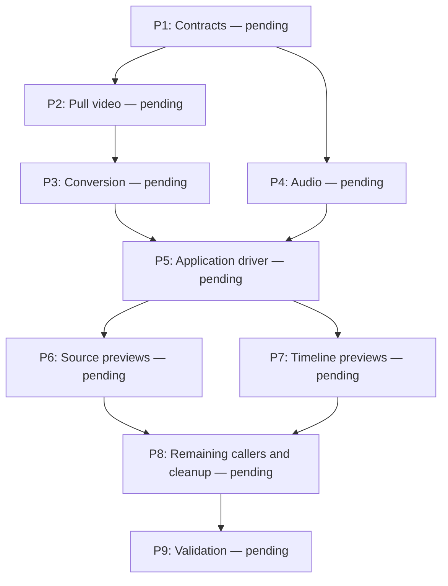

# Pull-based decoding and application-owned playback

## Objective and boundaries

The application pulls native frames, prepares their presentation, schedules them,
and updates GPUI. Media backends own decoding resources, not playback clocks,
presentation threads, UI notifications, or the currently displayed frame.

Preserve source-video/audio playback, volume/mute, seeking, EOF behavior, timeline
still previews, and frame stepping. Preserve CLI output and existing project-file
formats. This refactor does not add timeline playback/audio mixing, new GPU color
conversion, or new platform-specific hardware implementations. Reuse available
macOS VideoToolbox support and retain software decoding elsewhere.

This replaces the implementation direction in `timeline-decode-acceleration-plan.md`.
Its hardware acceleration and intermediate-frame skipping objectives remain.
No implementation is authorized by creating this plan.

## Interfaces and ownership

### Proposed API pseudocode

The user's proposed application-driven loop establishes the intended control flow:
pull a native FFmpeg frame, convert it, publish it through a GPUI entity update,
and asynchronously wait before pulling the next frame.

```rust
while true {
    let t = Instant::now();
    let frame = video_backend.next_frame(); // Native FFmpeg frame type.
    let rgba = convert_to_image(frame);
    editor.set_current_preview_frame(rgba); // GPUI entity update.
    let delta = t.elapsed();
    let wait = frame_time - delta;
    if wait > 0 {
        await sleep(wait);
    }
}
```

This is conceptual pseudocode, not the final Rust implementation. The detailed
design below retains this application-owned flow while running blocking work off
the UI thread, using interruptible absolute PTS deadlines, and handling commands,
errors, EOF, and audio synchronization. Duration subtraction must not underflow
when decoding takes longer than a frame interval.

### Pull decoding

- A synchronous `VideoDecoder::open(path)` exposes metadata and
  `next_frame(&mut self) -> Result<Option<DecodedVideoFrame>>`. `None` means fully
  drained EOF, never merely that the decoder needs another packet. The method
  internally pumps packets and handles decoder buffering/reordering.
- `DecodedVideoFrame` owns an `ffmpeg_next::frame::Video` plus normalized media
  presentation time and optional duration. Preserve color and rotation metadata;
  normalize timestamps consistently with the existing stream-origin behavior.
- `seek(&mut self, position) -> Result<DecodedVideoFrame>` locates the nearest
  presentation frame using frames bracketing the target, with the earlier frame
  winning ties, and leaves sequential reading ready to continue after that frame.
  Retain any decoded lookahead needed to avoid skipping the following frame.
  Clamp negative positions to zero and use the last frame when seeking past EOF;
  media with no decodable frame returns an error.
- A separate conversion component prepares a selected frame for display. Maintain
  decoder output format until selection: intermediate frames are not converted to
  RGBA, copied into image buffers, or rotated. Reuse the existing native-surface
  presentation path where supported; keep RGBA/BGRA preparation for timeline and
  software image presentation. Reconfigure conversion resources when the actual
  frame format, dimensions, or color metadata change.
- Timeline decoding exposes `frame_at(document, position) -> Result<TimelineFrame>`.
  The application supplies an immutable document snapshot and exact timeline
  frame. The decoder resolves visible active clips, maps source positions, and
  returns ordered layers. It owns reusable media readers/caches, not the editable
  document, playhead, worker, or displayed frame. Track stacking stays unchanged.

### Blocking execution and application state

- One application-owned playback task per active preview session drives commands,
  deadlines, and publication. Share its implementation between editor and debug
  player; keep it outside the decoder modules. GPUI entities contain display/control
  state and a session handle, never live FFmpeg contexts.
- Use one serial blocking execution lane per session, running on a background
  worker. Construct/use/drop native decoder and conversion resources on that lane;
  do not assume every FFmpeg or platform object is `Send`, or add unsafe `Send`
  implementations. Commands carry owned inputs and return owned results through
  awaited replies. Only cross-thread-safe prepared results leave the lane.
- This lane is an execution adapter, not a playback scheduler: no clock, sleeps,
  spontaneous decoding, polling loop, or presentation policy. It waits for work.
  Allow one active video operation and at most one prefetched frame; retain only
  the newest pending seek. Avoid per-frame OS thread creation and unbounded queues.
- Commands cover play, pause, seek/step, volume/mute, document replacement, and stop.
  Application state distinguishes requested position from displayed-frame time.
  Step updates the timeline playhead immediately and requests a paused preview.
  Scrubbing remains paused; source-file seeks preserve their existing resume rules.
- Use a session identity and request revision in work/results. Drop stale results
  after a seek, edit, source switch, or window close. Cancelling an await does not
  cancel a running FFmpeg call; retire the lane after that operation returns and
  dispose resources there, never join a decoding thread from GPUI.
- Business logic propagates errors. The application task logs once with debug
  formatting and updates UI status. Preserve the last good frame during loading
  or failure. Closed entities terminate publication cleanly.

### Timing and audio

- Silent video uses an application-owned monotonic clock with a media-time anchor.
  Frame deadlines derive from normalized PTS, not repeated `frame_time - elapsed`
  sleeps. Pause/resume and seek reset anchors without accumulating drift.
- Pull/prepare a frame ahead, then await its absolute presentation deadline before
  publishing it through an entity update. Waiting must be interruptible by control
  commands. Use timestamps for variable-rate video; retain existing handling for
  unusable timestamps rather than silently inventing frame cadence.
- If late, advance toward the clock position, discarding obsolete presentation
  candidates before expensive conversion where possible. Still decode reference
  dependencies. Do not reset the clock to hide decode slowness or drop frames during
  paused stepping. Bound catch-up work and check commands between decoder calls.
- Separate pull audio decoding/resampling from device output. The device callback
  only consumes prepared PCM and reports playback progress; it performs no media
  I/O, decoding, blocking waits, or application callbacks.
- With active audio, use the audio output's played media position, adjusted for
  device latency, as presentation authority. Keep PCM buffering bounded (reuse the
  existing output capacity initially), with an independent application refill task
  so video decoding cannot starve audio. Seek invalidates old audio blocks and
  resets sample position; underrun outputs silence without counting that silence
  as consumed media. Pause retains position. EOF completes only after queued media
  audio drains; video-only EOF retains the last frame.

### Hardware and skipping policy

- Prefer the existing VideoToolbox path for supported 8-bit H.264/HEVC MP4/MOV.
  Unsupported inputs or unavailable hardware initialization use software. A runtime
  hardware failure retries the requested position once through a fresh software
  decoder; software failure propagates. Expose the selected backend for diagnostics.
- Reuse existing target-aware non-reference skipping and output suppression where
  correctness is established. Preserve target/bracketing frames and dependencies.
  Do not globally set `AVDISCARD_NONREF`, which can remove requested frames. The
  software path keeps full decoding unless a safe skip decision can be proven;
  it still avoids conversion of discarded frames. No quality-reducing scrub mode.

## Progress and review checkpoints

0/9 active steps complete. Current step: none; awaiting implementation instruction.
Blockers: none. After each completed step, update this checklist, graph, evidence,
and progress summary, then pause for review unless the user waives checkpoints.
No new tests without an explicit request; migrate and run existing tests.

- [ ] **P1 — Establish contracts and ownership** (pending; no dependencies).
  Introduce the native-frame, metadata, command/result, and application session
  interfaces above. Map existing callers to their replacement interfaces and
  separate timeline document/playhead state from decoder state. Start with the
  high-level control flow; bodies may remain incomplete at this checkpoint.
  Evidence: interface/caller review shows a single owner for each resource and
  no playback timing or UI state in decoder contracts.
- [ ] **P2 — Extract the pull video decoder** (pending; depends on P1).
  Share existing decompression across playback and engine feature configurations.
  Implement native-frame next/seek/EOF, hardware selection/fallback, and safe
  target-aware skipping. Keep old callers working through temporary adapters.
  Evidence: existing applicable decode/seek fixtures pass, covering reordering,
  backward seeks, EOF, and software inputs; editor/CLI/player configurations compile.
- [ ] **P3 — Separate frame conversion and presentation** (pending; depends on P2).
  Move color conversion, rotation, and image preparation behind explicit selected-
  frame operations. Change the video element to accept a prepared frame snapshot
  rather than querying an autonomous backend. Preserve native-surface rendering.
  Evidence: existing image/preview checks pass; review confirms intermediate frames
  do not undergo RGBA conversion and rendering performs no decoding.
- [ ] **P4 — Separate audio decoding and device output** (pending; depends on P1).
  Expose pull PCM decoding and bounded output with played-position reporting;
  remove dependence on the old video backend's shared clock/control state. Preserve
  volume, mute, sample rate, channels, seek reset, underrun, and EOF behavior.
  Evidence: existing audio checks pass; callback review confirms no blocking work.
- [ ] **P5 — Implement the application playback task** (pending; depends on P3, P4).
  Implement serial background execution, interruptible deadline waits, audio refill,
  command processing, bounded lookahead, stale-result rejection, and background
  resource retirement. Instrument decode, conversion, scheduling lateness, and
  publication separately. Evidence: code review covers pause during decode, rapid
  seeks, source replacement, EOF, and errors without UI waits or busy polling.
- [ ] **P6 — Migrate editor source previews** (pending; depends on P5).
  Route video/audio selection and controls through the application session. Entity
  updates publish prepared frames and playback status. Keep cheap control-state
  updates synchronous; render reads state only. Evidence: manually verify source
  switching, play/pause, seek, volume/mute, audio-only files, and close during decode.
- [ ] **P7 — Migrate timeline preview and stepping** (pending; depends on P5).
  Replace TimelineBackend's worker/requested-frame publication with pull frame_at
  operations driven by the application. Keep editable state and playhead in timeline
  runtime state. Carry document snapshots/revisions in requests. Preserve native
  frame layers until presentation preparation; update persistence mappings without
  changing file formats. Evidence: existing timeline/preview/persistence checks pass;
  manually verify arrow stepping, rapid scrubbing, edits while decoding, text layers,
  source-preview-to-timeline transitions, and hidden tracks.
- [ ] **P8 — Migrate remaining callers and remove old scheduling** (pending; depends on P6, P7).
  Migrate debug player to the shared application controller and CLI image reads to
  the synchronous pull decoder/converter. Remove temporary adapters and unused
  presenter threads, polling, duplicated clocks, old backend snapshot APIs, and
  worker-joining UI destructors. Leave unrelated experimental examples alone unless
  required to compile. Evidence: caller search finds no production use of obsolete
  scheduling APIs; affected feature configurations compile. No player tests added.
- [ ] **P9 — Validate behavior and performance** (pending; depends on P8).
  Run existing affected suites with vendored FFmpeg. Compare identical seek sequences
  on the reported media before/after, recording actual selected decode backend,
  conversion counts, stage timings, and memory bounds. Manually verify variable-rate
  video, software fallback, A/V synchronization, long playback without clock drift,
  pause/resume, repeated/backward seeks, EOF, and app closure. Record unverified cases
  explicitly; no claimed speedup without measurements. Evidence: final validation
  record plus reviewed diff, with no FFmpeg build or new test code.

P2 and P4 are independent after P1; P3 can proceed alongside P4. P6 and P7 are
independent after P5. This describes dependency order, not permission to spawn agents.


