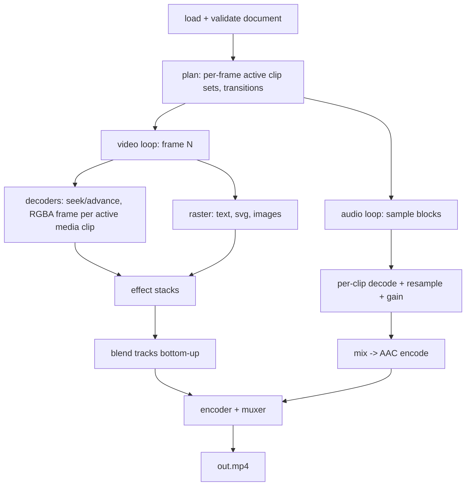

# OpenCut CLI — v1 Plan

A headless, agent-first video editing CLI. A single static Rust binary
(FFmpeg libs vendored/linked, no GStreamer, no browser) that programmers,
agents, and eventually normal users drive through a declarative JSON timeline.

Guiding principles:

- **Declarative first.** The timeline JSON document is the API. Every render is
  a pure function of `(timeline.json, source media) -> output file`. Mutation
  subcommands are sugar that read-modify-write the document.
- **Agent-legible.** Every command supports `--json` output, errors are
  machine-readable with stable codes, the schema is introspectable, and single
  frames can be rendered as stills so vision models can check their work.
- **Interoperable with the existing editor.** The CLI reads and writes the same
  `*.timeline.json` documents as the GUI editor
  ([timeline.rs](../editor/timeline.rs) `TimelineSerialization`), so the GUI
  becomes the "later stage" front-end for the same project files.
- **Small.** Target < 40 MB binary; hard ceiling 100 MB.

---

## 1. CLI design

Binary name: `opencut` (new `[[bin]]` target, `src/cli/main.rs`, feature `cli`).

### Command tree

```
opencut probe <media-file> [--json]
    Inspect a media file: container, duration, streams (codec, resolution,
    fps, sample rate, channels, rotation), keyframe interval estimate.

opencut new <timeline.json> [--width 1920 --height 1080 --fps 30]
    Create an empty timeline document with settings and one video + one
    audio track. Prints the created document path.

opencut validate <timeline.json> [--json]
    Parse + semantically validate: schema errors, missing/unreadable assets,
    clips referencing unknown tracks/assets, out-points beyond source
    duration, overlapping clips on the same track, non-finite numbers.
    Exit 0 = valid. Each finding has a stable code, a JSON pointer into the
    document, and a human message.

opencut inspect <timeline.json> [--json]
    Summarize a timeline: duration, tracks, clips with resolved times,
    asset usage, gaps. The agent's "look at the timeline" command.

opencut render <timeline.json> -o <out.mp4>
    [--range 2.0..10.5] [--scale 0.5] [--preset draft|standard|high]
    [--video-codec h264|hevc|prores] [--audio-codec aac]
    [--progress json|bar|none] [--overwrite]
    Full render. Progress on stderr (one JSON object per line in json mode:
    {"frame":120,"total":900,"fps":34.2,"eta_s":22.8}), result summary on
    stdout.

opencut still <timeline.json> --at <time|frame> -o <frame.png>
    [--scale 0.5]
    Render one composited frame to PNG/JPEG. This is the agent's preview
    window. `--at 3.5s`, `--at 105f`, or `--at 50%`.

opencut edit <timeline.json> <subcommand>
    Imperative sugar over the document (read → mutate → validate → write):
      add-track   --kind video|audio|text [--name N]
      add-clip    --track <id> --asset <path> --at <time>
                  [--in <time> --out <time>]
      add-text    --track <id> --text "Hello" --at <time> --duration <time>
                  [--font Inter --size 72 --color #ffffff --pos 0.5,0.5]
      move-clip   --clip <id> --to <time> [--track <id>]
      trim-clip   --clip <id> [--in <time>] [--out <time>]
      split-clip  --clip <id> --at <time>
      remove-clip --clip <id>
      set         --clip <id> --property opacity --value 0.5
                  (generic property setter, dotted paths allowed)
    Every edit prints the affected clip/track as JSON, so the agent gets
    generated IDs back without re-reading the file.

opencut schema [--format json-schema]
    Print the timeline JSON Schema to stdout. Agents fetch this to author
    documents zero-shot.

opencut docs
    Print a compact llms.txt-style usage guide (commands + format overview).
```

### Conventions (uniform across commands)

- **Time values**: accept `12.5` / `12.5s` (seconds), `375f` (frames),
  `00:00:12.500` (timecode). Internally everything is a rational
  frame count at the timeline fps (see §2 Time model).
- **`--json`**: machine-readable stdout. Human-readable is the default.
- **Exit codes**: `0` ok · `2` CLI usage error · `3` validation failed ·
  `4` missing/unreadable media · `5` render/encode failure · `6` I/O error.
- **Errors**: on failure with `--json`, stdout gets
  `{"error":{"code":"clip_out_of_range","pointer":"/clips/3/source_out","message":"...","file":"...","line":123}}`.
  Diagnostics carry `file!()`/`line!()` context per repo rules.
- **Determinism**: same document + same media ⇒ bit-identical frames
  (encoder output may vary by threading; frame content must not).
- Never writes outside `-o` targets and the given timeline path. `edit`
  writes atomically (temp file + rename) and preserves unknown JSON fields
  it does not understand (forward compatibility with the GUI editor).

---

## 2. Timeline JSON format

### Relationship to the existing editor format

The GUI editor already persists `TimelineSerialization`
(`settings/assets/tracks/clips`, adjacently-tagged `Clip` enum, ULID ids,
`TimelineTime` frame-based times). **v1 of the CLI adopts this format as the
base** rather than inventing a competitor — one project format, two
front-ends. The CLI adds fields the editor does not have yet (keyframes,
effects, transitions); the editor ignores unknown fields and the CLI
preserves them, so the formats can evolve without lockstep releases.

The shared types must therefore move out of `src/editor/` into a
front-end-agnostic core module (§3) that both the editor and the CLI depend
on.

### Document shape

```jsonc
{
    "version": 1,
    "settings": {
        "width": 1920,
        "height": 1080,
        "frame_rate": { "numerator": 30000, "denominator": 1001 },
        "sample_rate": 48000,
        "background": "#000000",
    },

    // Media are registered once, referenced by id. Paths are relative to the
    // timeline document's directory (matches the editor's project layout).
    "assets": [
        { "id": "01J8...A", "path": "media/interview.mp4" },
        { "id": "01J8...B", "path": "media/logo.svg" },
        { "id": "01J8...C", "path": "media/music.mp3" },
    ],

    // Track order defines compositing order: later video tracks render on top.
    "tracks": [
        { "id": "01J8...T1", "kind": "video", "name": "Main" },
        { "id": "01J8...T2", "kind": "video", "name": "Overlays" },
        { "id": "01J8...T3", "kind": "audio", "name": "Music", "muted": false },
    ],

    "clips": [
        // Media clip: a slice [source_in, source_out) of an asset, placed at
        // timeline_start. Times are frame counts at the timeline frame rate.
        {
            "type": "media",
            "id": "01J8...C1",
            "track_id": "01J8...T1",
            "asset_id": "01J8...A",
            "timeline_start": 0,
            "source_in": 90,
            "source_out": 390,
            "video_properties": {
                "position_x": 0.5,
                "position_y": 0.5,
                "scale": 1.0,
            },
            "audio_properties": { "gain_db": 0.0, "muted": false },

            // v1 additions ↓ (optional; absent = static values above)
            "opacity": 1.0,
            "effects": [
                { "type": "gaussian_blur", "radius": 8.0 },
                {
                    "type": "color_adjust",
                    "brightness": 0.0,
                    "contrast": 1.1,
                    "saturation": 1.0,
                },
            ],
        },

        // Text clip (already supported by the editor).
        {
            "type": "text",
            "id": "01J8...C2",
            "track_id": "01J8...T2",
            "timeline_start": 30,
            "length": { "secs": 4, "nanos": 0 },
            "properties": {
                "text": "Hello",
                "font": "Inter",
                "font_size": 72.0,
                "color": 4294967295,
                "position_x": 0.5,
                "position_y": 0.8,
            },
        },

        // v1 addition: still image / SVG clip (asset-based, no audio).
        {
            "type": "image",
            "id": "01J8...C3",
            "track_id": "01J8...T2",
            "asset_id": "01J8...B",
            "timeline_start": 0,
            "length": 150,
            "video_properties": {
                "position_x": 0.9,
                "position_y": 0.1,
                "scale": 0.25,
            },
        },
    ],

    // v1 addition: transitions reference the two clips they join. A transition
    // is valid only when the clips are adjacent on the same track.
    "transitions": [
        {
            "id": "01J8...X1",
            "type": "crossfade",
            "from_clip": "01J8...C1",
            "to_clip": "01J8...C4",
            "duration": 15,
        },
    ],
}
```

### Semantics

- **Time model**: integer frame counts at the timeline frame rate
  (rational, e.g. 30000/1001), matching the editor's `TimelineTime`. No
  floating-point timeline positions ⇒ no drift, exact clip adjacency.
  Sources with different fps are resampled to timeline frames by
  nearest-PTS selection at decode time. Audio is sample-accurate
  internally; frame times convert exactly via the rational fps.
- **Compositing**: tracks composite bottom-up in array order; within one
  video frame, for each video/text track pick the clip covering that frame
  (validation forbids same-track overlap), apply its effect stack, then
  alpha-blend onto the accumulated frame over `settings.background`.
- **Audio**: all audio tracks and the audio of media clips on video tracks
  are mixed (sum with per-clip gain, then master clip protection/limiter is
  out of scope for v1; document clipping behavior).
- **Coordinates**: `position_x/y` are normalized (0..1) relative to frame
  size, anchor at clip center — matches the editor. `scale` is relative to
  "fit within frame".
- **Effects (v1 set, CPU)**: `gaussian_blur`, `color_adjust`
  (brightness/contrast/saturation), `crop`, `flip`, `opacity` (implicit).
  All properties are static in v1. Keyframe animation is v2: it will be an
  additive `keyframes` field on clips (dotted property paths → easing +
  points), so v1 documents stay valid unchanged. GPU/WGSL effect stack is
  also v2 (§4).
- **Transitions (v1 set)**: `crossfade`, `dip_to_color`, `wipe`
  (direction param), `slide`. Audio crossfades with equal-power curve.

### Versioning

`"version": 1` at the root. The CLI refuses documents with a greater major
version; unknown fields at any level are preserved verbatim on rewrite.
JSON Schema is generated from the Rust types via `schemars` so
`opencut schema` can never drift from the implementation.

---

## 3. Architecture

### Module layout (within this crate, later splittable into workspace crates)

```
src/
  core/              # NEW: front-end-agnostic timeline model
    document.rs      #   TimelineSerialization + serde types (moved from editor)
    time.rs          #   TimelineTime, FrameRate (moved from editor)
    validate.rs      #   semantic validation -> Vec<Finding {code, pointer, msg}>
    schema.rs        #   schemars derivations, schema export
  engine/            # NEW: headless render engine (ffmpeg-next only)
    probe.rs         #   media inspection (reuse/adapt editor/media_probe.rs)
    decode.rs        #   per-asset decoder: frame-accurate seek + decode-forward,
                     #   PTS-indexed frame cache, sws_scale to RGBA
    audio.rs         #   decode + swresample to timeline sample rate, mixer
    compose.rs       #   frame scheduler: for output frame N resolve active
                     #   clips -> fetch source frames -> effects -> blend
    raster.rs        #   text (cosmic-text), SVG/images (resvg/image), shapes
    effects.rs       #   v1 CPU effects + transitions
    encode.rs        #   libav encoder/muxer; VideoToolbox on macOS, x264 opt-in
    render.rs        #   top-level: document -> output file / single still
  cli/               # NEW: thin binary
    PLAN.md          #   this document
    main.rs          #   arg parsing (clap), dispatch, exit codes
    output.rs        #   --json vs human formatting, progress reporting
    commands/        #   one module per subcommand (probe, render, edit, ...)
  editor/            # existing GUI; refactored to depend on core/
```

Dependency rule: `cli -> engine -> core`, `editor -> core` (and, later,
`editor -> engine` to replace its GStreamer preview/export). `core` has no
FFmpeg or GUI dependencies. Features: new `cli` feature enabling
`core + engine` (`serde`, `serde_json`, `clap`, `schemars`, `ffmpeg-next`,
`cosmic-text`, `resvg`, `image`, `ulid`); no `gpui`, no `gstreamer-*`.

### Render pipeline (per render)



Key design points:

- **Pull-based, sequential output**: output frames are produced strictly in
  order; each active media clip keeps a decoder that mostly _advances_
  (cheap) and only _seeks_ on clip entry or discontinuity (seek to prior
  keyframe, decode forward to target — the frame-accuracy contract lives
  entirely in `decode.rs` and gets the densest test coverage).
- **Threading**: decoders run on worker threads feeding bounded channels
  (values in messages, no shared mutable state, per repo rules); compositor
  consumes; encoder on its own thread. rayon for per-frame pixel work.
- **Color**: v1 converts everything to 8-bit sRGB RGBA for compositing and
  encodes as BT.709. Correct-but-simple; document it. HDR/10-bit is out of
  scope.
- **Stills** reuse the identical pipeline with a 1-frame range and a PNG
  "encoder", guaranteeing preview == render.
- **Error handling**: engine functions propagate `Result` with
  `file!()`/`line!()` context; only `cli/main.rs` logs/prints.

---

## 4. Everything else needed for v1

### FFmpeg build & licensing

- Keep using `ffmpeg-next` (already a dependency, v8.1). Add a build recipe
  (script in `rust/scripts/`) for a trimmed static FFmpeg: demuxers
  mp4/mov/mkv/mp3/wav/flac/webm, decoders h264/hevc/vp9/av1/aac/mp3/pcm/flac,
  encoders aac + png + platform (VideoToolbox on macOS); muxers mp4/mov.
  `libx264` behind an off-by-default `gpl` cargo feature.
- LGPL compliance: ship object files or dynamic libav variant for
  distribution builds; document in README.
- Size check in CI: fail if the release binary exceeds 100 MB (target 40).

### Testing strategy

- **Fixtures**: tiny generated media (2–5 s, testsrc-style patterns with
  burned-in frame numbers, sine-wave audio with known phase) committed under
  `rust/data/` or generated by a script at test time.
- **Frame-accuracy tests**: render stills at clip boundaries, split points,
  and transition midpoints; assert on the burned-in frame number via pixel
  sampling. This catches off-by-one-frame seek bugs, the #1 defect class.
- **Audio tests**: render, decode result, assert sample counts, silence
  gaps, gain, and crossfade power.
- **Golden documents**: round-trip (`load -> save`) must preserve unknown
  fields; editor-created `.timeline.json` files must validate and render.
- **CLI-level tests**: run the binary against fixtures, assert JSON output
  shapes and exit codes.
- Determinism test: two renders of the same document produce identical
  frame hashes.

### Agent-facing polish (cheap, high leverage)

- `opencut schema` + `opencut docs` as first-class commands (not a wiki).
- Every `edit` subcommand echoes created/modified entities with ids as JSON.
- `validate` findings include a `fix_hint` string where a fix is mechanical
  ("reduce source_out to ≤ 312").
- `--dry-run` on `render` (plan summary: duration, frames, active clip
  count, estimated output size) so agents can sanity-check cheaply.
- Stable stderr/stdout split: stdout = data, stderr = progress/logs.

### Milestones

1. **M1 — core extraction**: move document/time types from `editor/` to
   `core/`, editor still green; add `validate`, `schema`, `new`,
   `inspect`, `probe`. (No rendering yet; already agent-useful.)
2. **M2 — still renderer**: decode + compose + text/image raster + PNG out
   (`still`). Frame-accuracy tests.
3. **M3 — full render**: video encode loop + audio mix/encode + progress
   (`render`). Determinism + A/V sync tests.
4. **M4 — edit sugar + effects/transitions**: `edit` subcommands and the
   v1 effect/transition set.
5. **M5 — distribution**: trimmed static FFmpeg build scripts, size CI,
   README + llms.txt, prebuilt macOS binary.

### Explicit non-goals for v1

Keyframe animation (v2; the format is designed so it lands as an additive
field), GPU/WGSL effect plugins, Lottie, nested timelines/compound clips, proxies,
variable-fps _output_, HDR/10-bit, waveform/thumbnail generation for UIs,
MCP server (a v2 wrapper around the same library), Windows/Linux platform
encoders (software fallback works there).

### Resolved decisions

1. **Audio timing**: clip boundaries are frame-quantized (`TimelineTime`
   frame counts); mixing inside those boundaries is sample-accurate.
2. **Entity references**: tracks and clips are referenced by their unique
   string ids only — no positional indexes. `edit` subcommands always echo
   generated ids as JSON so agents never need to re-derive them.
3. **Provenance**: `render` embeds the source timeline document as MP4
   metadata, with a `--no-metadata` opt-out.
