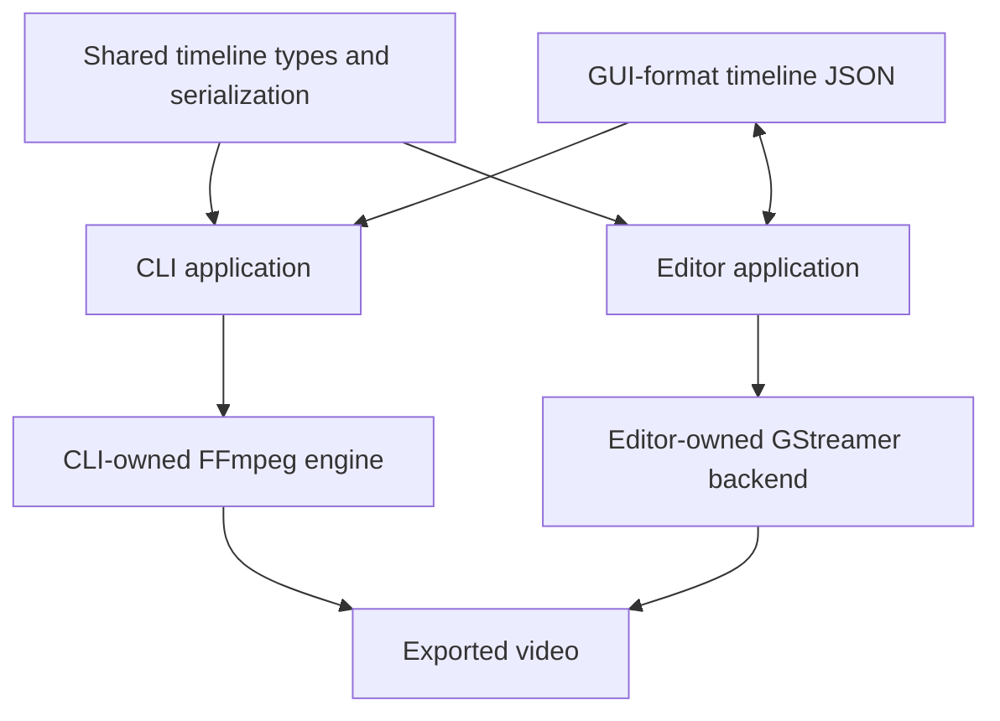
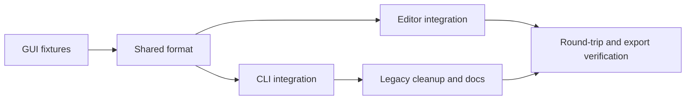
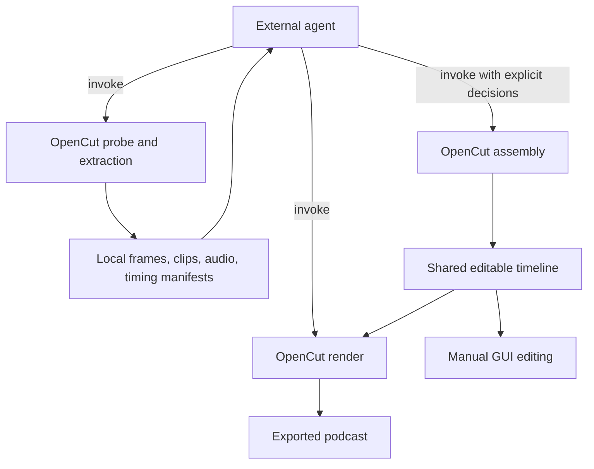

# Shared timeline format, then agent-assisted podcast editing

## Immediate milestone: one timeline format

The CLI and editor use the existing GUI timeline format and the same Rust
serialization types. The CLI exports through FFmpeg; the editor edits and exports
through GStreamer. Legacy CLI format compatibility is intentionally removed.

Top-level modules are applications (`cli`, `editor`, `player`) or shared components
(`timeline`, `video`, `video2`). There is no generic `core` layer or top-level
FFmpeg engine. Application-specific helpers stay beneath their application.
The shared [timeline module](../timeline/mod.rs) contains document representation,
serialization rules, and the time/accessor semantics of that representation. It
contains no filesystem I/O, renderer state, or GStreamer editing operations.

The immediate task is format unification. It does not add a shared editing API,
agent assembly commands, SRT import to the CLI, or AI analysis. Whether an agent
writes JSON directly or invokes assembly commands will be decided separately.

## Modules and interfaces

| Owner | Responsibility |
| --- | --- |
| `timeline` | GUI document/settings/assets/tracks/clips/view types, rational frame/time representation, Serde rules and existing GUI aliases, in-memory parsing and parse errors. |
| `cli` | File loading, validation/reporting, atomic output, schema command, media probing, rendering options, and its FFmpeg engine. |
| `editor` | File loading/saving, GUI repair policy, edits, history, interactive state, existing SRT import, GStreamer playback/export. |
| `player`, `video`, `video2` | Existing application/backend responsibilities; no changes required for this milestone. |

Features expose the shared format without either backend. `timeline-schema` adds
JSON Schema generation; `cli` and `editor` depend on the shared format. Applications
render the same document directly, without a permanent two-format conversion bridge.

The format retains GUI clip tags (`kind`/`data`), ULIDs, asset metadata, integer
frame positions/source bounds, duration-based text lengths, pixel-offset video
transforms, normalized text positions, and view state. Video visibility and audio
muting are independent. Earlier tracks have higher visual priority, with text
above video. Locking and view state do not affect rendering.

Relative asset paths resolve from the project root. CLI `--project-root` defaults
to the working directory; nested timeline files do not change that base. Original
media must remain available for editing/export. Existing valid GUI documents keep
their supported content and semantics; old CLI documents fail explicitly.

## Priorities, tasks, and dependencies

- [x] **F1 · P0:** Capture representative GUI-format fixtures. **Depends on:** none. **Acceptance:** Video, audio, image, text, transforms, track flags, fractional rate, and view state are represented.
- [x] **F2 · P0:** Extract shared types and serialization without I/O/backend dependencies. **Depends on:** F1. **Acceptance:** Standalone format build and round-trip tests pass.
- [x] **F3 · P0:** Rewire editor to shared types; keep editor-owned operations and persistence. **Depends on:** F2. **Acceptance:** Existing timeline/editing tests and GUI build pass.
- [x] **F4 · P0:** Adapt CLI commands, validation, and FFmpeg renderer to shared types. **Depends on:** F2. **Acceptance:** CLI accepts GUI files; timing, layering, transforms, and audio flags match the contract.
- [x] **F5 · P0:** Remove legacy CLI model/edit/effect code and refresh schema/docs. **Depends on:** F4. **Acceptance:** No second document format; legacy inputs produce explicit errors.
- [x] **F6 · P0:** Verify saved-file round trips and both backend exports through the synthetic integration test. **Depends on:** F3, F4, F5. **Acceptance:** Exercise editor open/edit/save operations and render that file through CLI; compare source/timing/audio/geometry.

## Verification

Implemented F1–F6: shared types, both integrations, legacy cleanup, and the synthetic
round-trip/export test. The editor now renders text on independent transparent
title layers, so source transforms do not scale or reposition captions. Backend
frame boundaries and ARGB text colors are covered by the integration checks.

`cargo test-mac` passes all 97 editor tests and 4 timeline integration tests,
including the previously stalled GES editing tests and the platform export tests.
The macOS export tests pass with access to native media services outside the tool
sandbox, including VideoToolbox export.

- [x] Preserve all supported GUI fields through serialization; keep existing GUI aliases.
- [x] Validate missing references, malformed field types, overlapping clips, and legacy CLI input.
- [x] Exercise nonzero trims, fractional/mixed frame rates, image duration, gaps, and text cue boundaries.
- [x] Check layer order, pixel transforms, hidden-video audio, track/clip mute, and lock independence.
- [x] Verify absolute and project-relative paths, including nested timeline files.
- [x] Exercise editor save operations, change a cut and caption, save again, and render that exact document through both backends in the synthetic integration test.
- [x] Compare duration, camera/content selection, audible tracks, and placement. Font rasterization and encoded bytes need not be identical.
- [x] Build the format without media dependencies, CLI without GUI dependencies, and editor without the CLI feature.
- [x] Link vendored FFmpeg; never build FFmpeg or include Python in the build.
- [ ] Repeat the open/edit/save/export workflow manually in the GUI.

## Podcast implementation milestone

The goal is an agent-edited podcast that produces both an editable shared timeline
and an exported episode. The first supported recording setup is one or two cameras
and one authoritative audio source (a separate recording or a camera audio stream).
The agent supplies synchronization, retained content, camera choices, and optional
captions. Audio-only publishing and additional independent microphones follow later.

### Invocation boundary

Only the agent invokes OpenCut. OpenCut never calls an agent, model provider,
transcription service, or diarization worker. It has no model selection, credentials,
prompt construction, automatic editorial policy, or agent session state.

OpenCut exposes deterministic CLI operations with JSON results and local artifacts.
The agent decides which artifacts to inspect, uploads them to its own services if
needed, interprets speech/sounds/images, and invokes assembly and rendering. Model
capability differences remain the agent's responsibility. An audio-capable agent
can request WAV segments; a vision-capable agent can request frames; a text-only
agent can obtain transcripts externally. No MCP server is needed for this milestone.

### Authoring interface and ownership

Choose a declarative `assemble` CLI command over a long sequence of mutable editing
commands. Its input is an assembly recipe; its output is the existing timeline
format. The recipe is a command input, not another editable project format. Direct
shared-timeline JSON authoring remains possible through the existing schema.

The recipe contains output settings, named source references, selected stream
indices, explicit source offsets, the master audio selection and gain, retained
intervals, camera selections, and optional caption cues. Generate the recipe schema
from its Rust types. Do not infer offsets or camera identity from filenames.

CLI-owned recipe parsing, validation, compilation, and reports live beneath `cli`.
Extraction and measurement stay beneath its FFmpeg engine. The shared `timeline`
module continues to own only document representation and time/serialization rules.
If a requested stream cannot be represented by the current asset/backend contract,
reject it initially; add shared stream selection only with both-backend support.

Proposed commands below are not implemented yet:

- `opencut assemble recipe.json -o episode.timeline.json --json`
- `opencut assemble recipe.json --dry-run --json`
- `opencut extract audio recording.mov --range 60s..90s -o speech.wav --json`
- `opencut extract frames camera.mp4 --at 60s,65s,70s -o frames/ --json`
- `opencut extract video camera.mp4 --range 60s..90s -o sample.mp4 --json`
- `opencut analyze audio master.wav --range 0s..120s --json`

Extend `schema` with a recipe selector without changing its current default.
Extraction accepts explicit stream selection, channel handling, and output size or
sample rate where relevant. Return artifact paths and timing manifests, not media
bytes in JSON. Reuse `probe`, `validate`, `inspect`, `still`, and ranged `render`.

### Time and assembly contract

Use the master audio's source clock as the episode reference clock. For each
recording, define `source_time = episode_time + source_offset`; positive offsets
mean the same event occurs later in that source file. For example, an event at
master time 10 seconds with camera offset +2 seconds uses camera time 12 seconds.
Constant offsets are supported initially; drift correction is explicit future work.

Recipe time values use integer ticks plus an explicit rational time base, not
floating-point seconds. All ranges are half-open. Retained intervals must be
chronological, nonempty, and nonoverlapping; reordering and repetition are deferred.
Camera selections and captions use the uncut episode clock. Source bounds are
checked after applying offsets. Missing coverage is an error, not an implicit
freeze frame, black frame, or fallback camera.

Quantize boundaries once to the project's rational frame grid. Report effective
boundaries and rounding adjustments; reject intervals that collapse after rounding.
Audio cuts are frame-aligned under the existing shared format. Do not promise
sample-accurate editorial cuts without a future shared-format change.

For retained interval `[a,b)` starting at output time `o`, map episode time `t` to
`o + (t-a)`. The next retained interval starts immediately after this interval.
Use this same map for cameras, audio, and captions. Camera switches split video,
not the master audio; all camera audio is muted. Cuts remove time from every track.
Report source, episode, and output ranges so agents can translate later findings.

Captions are optional supplied data, not internally generated transcription.
Structured word timestamps allow removal of words inside deleted ranges and
regrouping of retained words. For cue-only JSON or SRT, fully retained cues can be
retimed and fully removed cues dropped. A cut through a cue must produce a finding
requiring replacement text or word timing; never silently retain deleted speech in
the caption. Speaker names/IDs are optional metadata, not inferred camera choices.

The output timeline is authoritative after manual editing. Reassembly writes a new
file and does not merge with or overwrite GUI edits by default. Normal existing
explicit-overwrite rules apply. Failed validation leaves no partial timeline.

### Ordered implementation tasks

- [ ] **P1 · Recipe and timing contract.** Depends on F1–F6. Define recipe types,
  schema, findings, offsets, retained intervals, camera coverage, and caption input.
  Acceptance: fixtures cover one/two cameras, a silent camera, separate master
  audio, positive/negative offsets, and fractional frame rates; invalid references,
  missing coverage, collapsed intervals, and unsupported streams fail explicitly.
- [x] **P2 · Assemble supplied decisions.** Depends on P1. Compile a recipe into
  existing assets/tracks/clips, with a pure interval map and CLI-owned I/O. Add
  dry-run reports, atomic writes, and explicit overwrite handling. Acceptance:
  remove a middle segment, switch cameras, preserve master audio without doubling
  or restarting it at camera switches, and render the generated timeline through
  both backends. Original media is never modified.
- [ ] **P3 · Media extraction for agent inspection.** Depends on P1; needed for the
  full agent workflow, not for assembly with supplied decisions. Add bounded WAV,
  frame, and video extraction using existing vendored FFmpeg libraries. Manifests
  identify source/stream, requested and actual source timestamps, duration, output
  format, and timestamp origin. Acceptance: nonzero source PTS, seek preroll, EOF,
  silent/no-audio cameras, channel selection, and fractional rates are handled;
  extraction decodes accurate boundaries rather than pretending keyframe seeks
  are exact. Range size and frame count are explicitly bounded by the caller.
- [ ] **P4 · Retimed captions.** Depends on P2. Accept structured supplied captions
  and SRT, compile text clips, and optionally write retimed SRT. Acceptance: words
  removed by cuts disappear, captions stay synchronized across multiple cuts,
  cue-only boundary ambiguities are actionable, and both renderers show matching
  caption timing. Transcription and diarization remain outside OpenCut.
- [ ] **P5 · Audio measurements and clean cut joins.** Depends on P2/P3. Expose
  channel-aware levels, clipping counts, and threshold-based silence intervals;
  return thresholds, window sizes, and timestamp units. Silence is a measurement,
  not a decision to delete speech. Add explicit short fade-in/out durations to the
  shared audio properties with backward-compatible zero defaults and support in
  both renderers/editor persistence. Clamp or reject fades longer than clips;
  do not alter episode duration. Acceptance: synthetic discontinuities have
  reduced boundary jumps, fades do not restart on camera switches, and gain/mute
  behavior remains consistent. Crossfades, denoising, and mastering are deferred.
- [ ] **P6 · Complete agent-driven podcast acceptance.** Depends on P2–P5. Update
  CLI help, README, and `docs` with extraction/recipe examples, capability limits,
  error recovery, and an external-agent workflow. Exercise a real recording plus
  synthetic timing fixtures. Acceptance: the agent can inspect sources, obtain
  transcription externally, supply offsets/cuts/cameras/captions, assemble,
  preview joins using ranged render, revise the recipe, and export an episode;
  the saved timeline opens, can be edited/saved, and exports in the GUI.
- [ ] **P7 · Long-recording reliability.** Depends on P6. Run a two-hour fixture
  with many cuts; measure memory, extraction latency, render throughput, output
  size, duration, and beginning/end synchronization. Stream decoding and bound
  buffers; do not retain all frames or PCM in memory. Reuse existing progress and
  cancellation conventions; failures must not leave committed partial outputs.
  Establish measured baselines before adding persistent caches or job services.

The first P1/P2 implementation slice is implemented: recipe schema, explicit
source offsets, master audio and gain, retained intervals, camera coverage,
frame-rounding reports, dry-run validation, and atomic timeline assembly. P1's
caption contract remains deferred to P4. Explicit stream selection is rejected
until the shared format and both backends can represent it. Source files with
multiple video or audio streams are rejected.

P3 is the next implementation slice: bounded media extraction for the external
agent. P4–P6 complete captioning, audio joins, and the inspection/review loop. P7
gates long-form readiness. No model calls have been added to OpenCut.

### Verification and completion

Assembly slice verification: 5 assembly integration tests, 9 existing CLI tests,
and 5 shared-timeline tests pass. The 2 editor cross-backend tests also pass,
including assembly, editor load/save, camera-cut boundaries, output duration, and
master-audio gain/muting through both FFmpeg and GStreamer. The optional standalone
VideoToolbox CLI test remains ignored in the regular CLI suite.

Use Rust synthetic media fixtures and the existing CLI/shared-timeline/backend
integration harness. Verify the interval map at boundaries, offset sign, source
coverage, exact output frame count, caption content after cuts, and absence of
camera audio leakage. Compare decoded output and source-event positions, not
encoded file bytes. Test JSON errors and output preservation on failure.

For manual acceptance, use a two-person podcast with one camera lacking audio,
known synchronization offsets, a removed mistake, a shortened pause, several
camera switches, and captions spanning a removed section. Listen across every
join and check lip sync near the beginning and end. Silence/correlation evidence
cannot establish alignment for a camera with no common audio; the agent supplies
an offset from visual evidence or user input. Uncertain alignment should be
resolved before assembly, never guessed by OpenCut.

All media work links the existing vendored FFmpeg libraries; no FFmpeg rebuild or
Python build dependency. New error contexts include Rust file and line locations,
propagate through helpers, and are logged only at the command/task boundary.

Deferred: automatic transcription/diarization or LLM calls inside OpenCut;
automatic speaker-to-camera policy; drift correction; independent microphone
mixing; arbitrary segment reordering; audio-only distribution formats; background
music ducking; loudness normalization/limiting; and advanced transitions. These
are not prerequisites for the first explicit-decision video podcast workflow.

### Real recording: content edit and CLI friction (2026-09-10)

The first attempt on the 17:56 screen demonstration only trimmed the ends and
changed gain. That was a valid document but failed the editorial goal. Validation
must not be presented as evidence that a video is well edited.

The revised [episode timeline](../../data/tests/podcast-edit/episode.timeline.json)
contains 18 retained source sections (36 synchronized media clips) plus five
Chinese title/chapter cards. Duration is 14,484 frames at 24000/1001 fps: 10:04.1035,
about 44% shorter than the original. It preserves the two principal video examples,
prompt construction, shot size/camera movement, and the advice to generate variants
and select footage. It removes application-promotion asides, repeated explanations,
playback-control setup, a browser/typing detour, later repetitive examples, and the
closing paid-group promotion. The original source remains untouched.

Review used a local cached Whisper model through a temporary external transcription
environment, plus source-frame storyboards from the existing vendored FFmpeg binary.
This is agent-side analysis, not an OpenCut model integration or build dependency.
The transcript contains recognition errors and was not published as captions.
Frame inspection distinguished the first example's frozen playback controls from
its actual playback: source 83–104 seconds was setup, while the subsequent playback
was retained. A word-boundary audit caught seven cuts inside recognized words/filler;
boundaries were adjusted before final validation. ASR timing remains approximate.

The [edit decisions](../../data/tests/podcast-edit/content-review/edit-decisions.json)
record effective source and output frame bounds. The [boundary audit](../../data/tests/podcast-edit/content-review/word-boundary-audit.json)
checks those bounds against recognition timestamps. The previous minimal timeline
is preserved separately. The recipe compiles the media edit, then a task-local
script adds title cards and shifts all corresponding video/audio positions together.

| Priority | Observed difficulty | Required CLI work |
| --- | --- | --- |
| P0 | `probe` provides metadata, but agents cannot request source audio, clip excerpts, or a timestamped storyboard. Review required FFmpeg outside OpenCut. | Implement P3 extraction with explicit stream/channel/range selection, limits, and timestamp manifests. |
| P0 | Silence detection alone suggested trimming useful playback or could clip quiet words. A transcript segment also incorrectly spanned a minute of navigation. | Accept external word/cue timing as review data; expose precise source/output mappings and boundary-review excerpts. Editorial judgment stays with the agent. |
| P1 | Assembly accepts retained intervals but no chapter cards, annotations, or transcript/caption inputs. Adding cards required editing JSON and manually shifting every track. Reassembly would erase those additions. | Extend recipe authoring with explicit cards/titles and supplied captions, compiled through one time map. Keep the saved timeline authoritative after GUI edits. |
| P1 | The CLI renderer loaded only embedded IBM Plex Sans, which does not supply Chinese chapter glyphs. | System fonts are now loaded before the embedded fallback. Chinese title output was visually verified; a macOS regression test checks that two Chinese characters render distinct glyphs. Add explicit font availability/portability reporting for other machines. |
| P1 | Cut points can land inside words after frame quantization. Seven candidate boundaries needed adjustment. | Report effective boundaries against optional supplied word intervals and generate a join-review reel; do not automatically trust transcription timestamps or delete speech. |
| P1 | Static gain is available, but there is no fade envelope or cut crossfade. | Implement P5 join fades in the shared format and both backends. Review audio joins; do not equate schema validation with smooth audio. |
| P1 | HEVC failed inside the sandbox with a generic external-library error. A successful dry-run does not prove the encoder can open. | Error context now includes encoder, dimensions, frame rate, and the VideoToolbox service-access hint. Add actual encoder preflight; retain explicit software-encoder choices. |
| P1 | Sending SIGINT to revise the in-flight edit exited with code 130 and left an 18 MB `.opencut-*.mp4` file. The final destination was correctly uncommitted. | Add graceful cancellation, encoder/worker teardown, and cleanup of the current staged artifact. Do not delete unrelated temporary files. No resume/checkpoint support exists yet. |
| P2 | Even trim-only changes re-render every video frame; the debug preview ran at about 6.9 fps at 2268×1472. | Use release builds for real media and consider constrained smart rendering. An unnecessary same-size frame copy was removed; its isolated speedup was not benchmarked. |

Acceptance for this recording: multiple intentional internal edits, preserved example
playbacks, readable chapter cards, matched video/audio cuts, valid source references,
and a valid editable shared timeline. The current checks do not replace a complete
human listening review or prove that every recognition-derived cut is imperceptible.

Final export check: HEVC output is 2268×1472 at 24000/1001 fps, with exactly
14,484 video frames and duration 604.103500 seconds. AAC duration is 604.103000
seconds. Audio decoding completed with a measured peak of -3.2 dBFS (mean -29.9
dBFS; loudness mastering remains a separate gap). First/last exported frames and
Chinese title-card images were inspected. Export completed at about 38.2 fps.
The source checksum is unchanged. The CLI/assembly/timeline tests pass (20 tests,
one optional hardware test ignored), and both editor backend integration tests
pass. The final [video](../../data/tests/podcast-edit/edited.mp4) and timeline are
available together in the test output folder.
