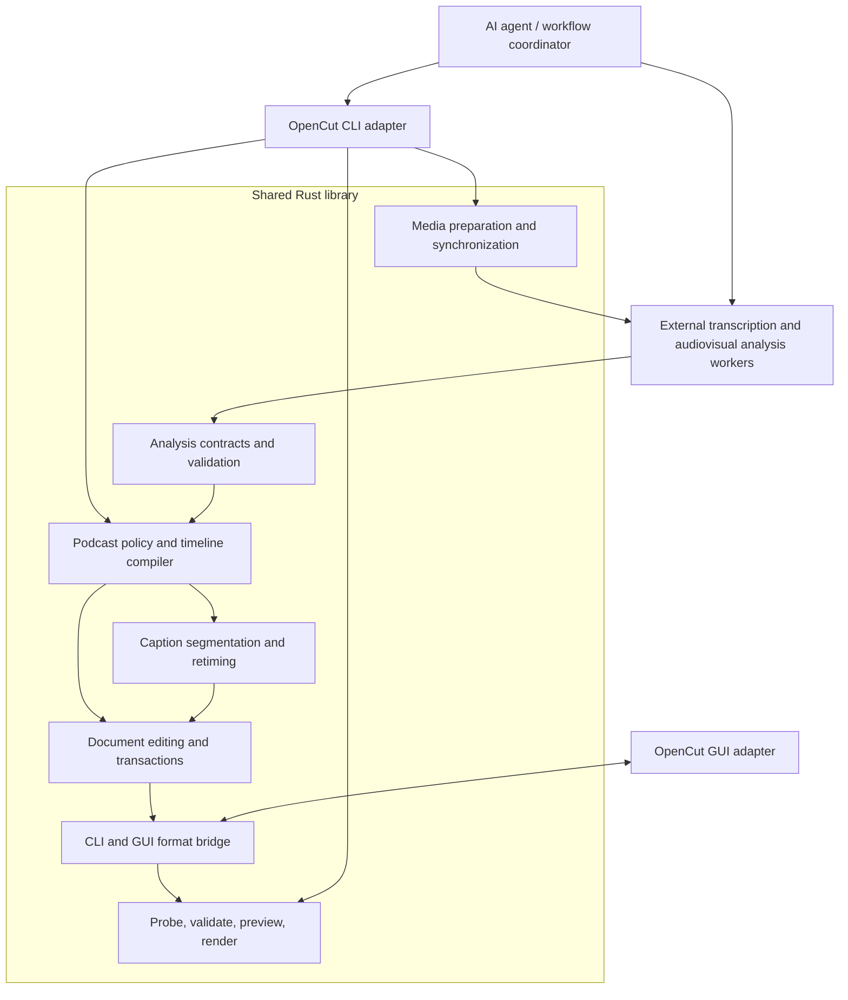
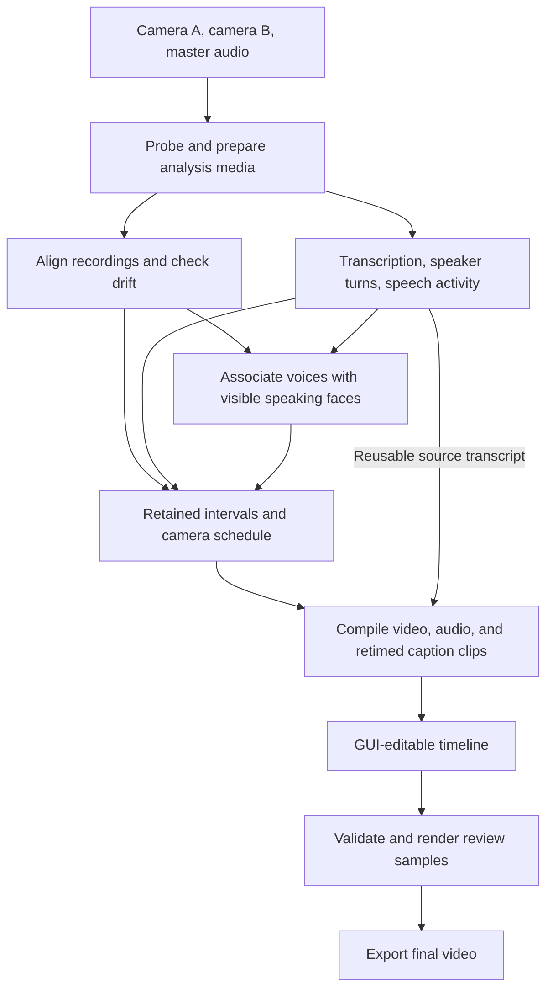
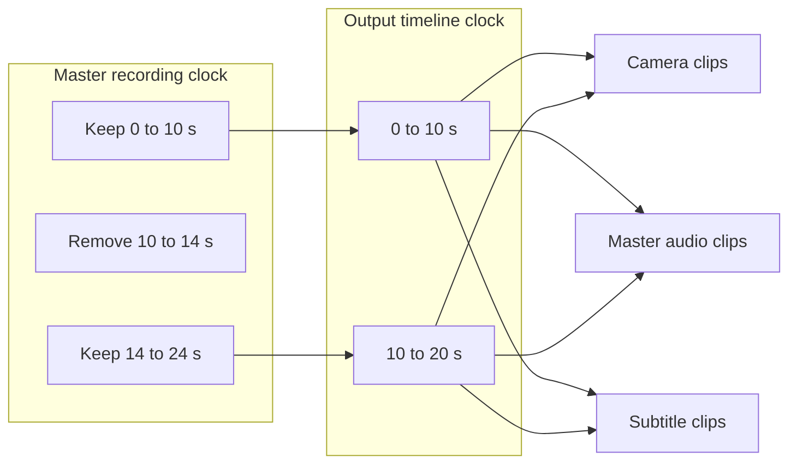
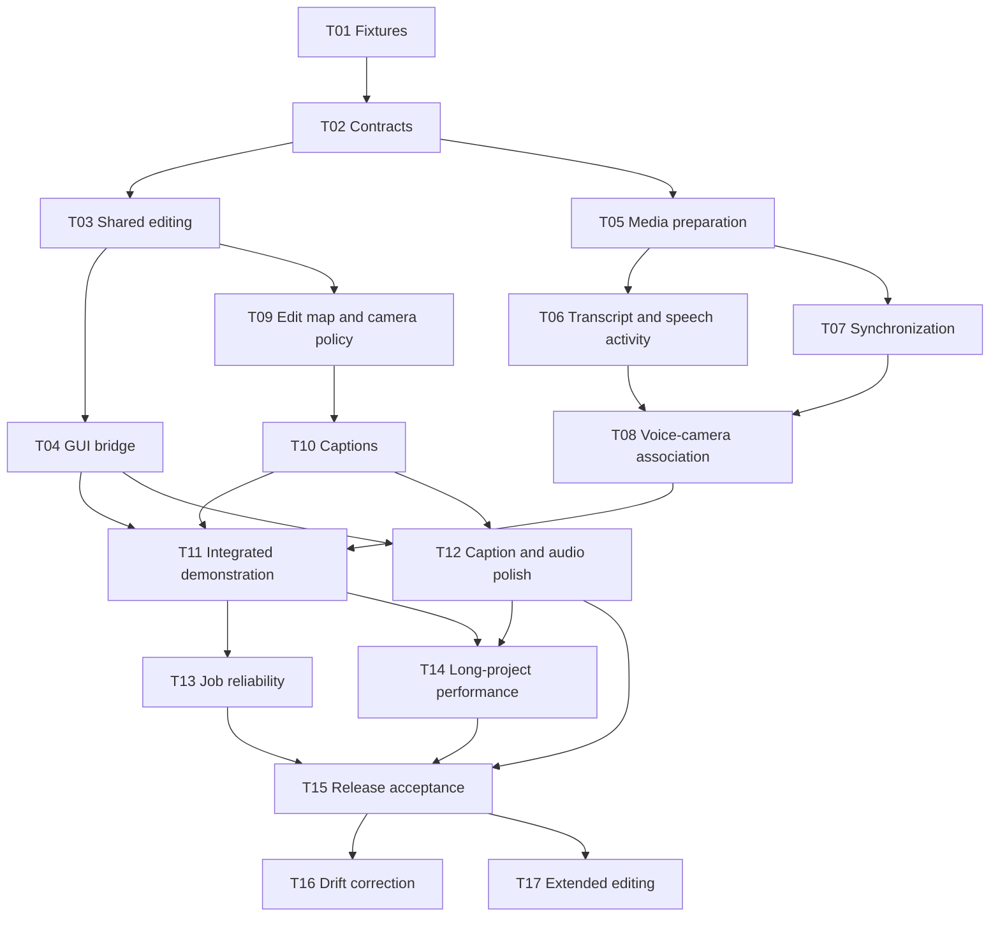

# Agent-assisted podcast editing

Status: implementation plan; unchecked tasks are not implemented.

## 1. Goal and scope

An AI agent and OpenCut should turn two approximately two-hour camera recordings into:

1. An exported video with long silent pauses removed, camera cuts following speakers, and visible subtitles.
2. A timeline that opens in the OpenCut GUI, with editable cuts, audio, and subtitle text, and can be saved and exported again.

Each camera shows one participant. Both files may contain the same conversation audio, or only one may contain the master audio. Camera identity must be associated with voices automatically using evidence from the recordings. This is not an isolated-microphone workflow.

Original recordings remain unchanged. The timeline references those recordings; handing off the timeline requires retaining the referenced media. Exported captions are burned into the video, while timeline captions remain separate text clips. An SRT of the edited output is an optional supporting artifact.

V1 uses full-frame hard camera cuts, one master audio source, conservative pause removal, and static subtitles. It does not require speaker names, speaker isolation, generative video, reaction-shot storytelling, animated captions, or interchange with third-party editors. Recoverable ambiguity produces a targeted agent question or supplied override; it must not silently become a confident camera assignment.

## 2. Current foundation and gaps

| Capability | Current implementation | Work required |
| --- | --- | --- |
| Inspect source media | [Media probing](../engine/probe.rs#L50) | Audio/video sample extraction and source synchronization. |
| Create, move, trim, split, remove clips | [CLI editing](edit.rs#L15) | Shared library API, batch edits, and coordinated removal of time across tracks. |
| Construct camera cuts | Media clips reference source ranges and timeline positions. | Detect speaker turns, associate voices with cameras, and choose shot boundaries. |
| Mix and mute audio | [Audio mixer](../engine/audio.rs#L18) | Master-audio selection independent of camera selection; short audio-only edge fades at removed pauses. |
| Render timed text | [Text clip creation](edit.rs#L89) and [text renderer](../engine/raster.rs#L31) | Transcription, CLI subtitle import, cue layout, and retiming. |
| Parse SRT | [GUI SRT parser](../editor/srt.rs#L7) | Extract timestamp/text parsing from GUI-specific clip construction. |
| Validate and save | [Document parsing and atomic writes](../core/document.rs#L330) | Validate a whole generated edit once and return structured findings. |
| Export video | [Renderer](../engine/render.rs#L202) | Long-project performance, cancellation, and output/GUI parity validation. |
| Edit timeline in GUI | CLI and GUI have different formats, explicitly documented in the [CLI README](README.md#L3). | A shared format bridge and tested open/edit/save/render round trips. |

An agent can already generate a complete CLI JSON document from externally supplied decisions, validate it, and render it. There is no current automatic podcast-analysis pipeline. Repeated single-edit CLI calls also load, probe, validate, and save on every operation, which is unsuitable for assembling thousands of captions.

## 3. High-level architecture

The agent chooses tools, coordinates jobs, interprets uncertain findings, and adjusts editorial policy. OpenCut provides reusable media operations, explicit analysis contracts, deterministic timeline compilation, validation, and export. The renderer does not call AI services.

### Module responsibilities

Names below are proposed library boundaries, not a requirement for one file per row.

| Module | Responsibilities | Dependencies and exclusions |
| --- | --- | --- |
| `core` | Document types, rational time conversion, semantic validation, structured errors. | No Clap, GPUI, GStreamer runtime, or AI provider dependency. |
| `editing` | Typed edit commands, affected entities, transactional batch application, source-to-output interval mapping. | Depends on `core`; receives resolved asset data directly; no implicit file saving or probing. |
| `formats` | Load/save current CLI format and the supported GUI format; normalize both into the render/edit model. | Shared serialization DTOs, not GUI runtime objects. Preserve supported properties and unrelated extension data. |
| `media` | Probe, extract bounded audio/video samples, establish offsets, measure drift, prepare proxies if required. | Reuses the existing vendored FFmpeg libraries. No model execution in document editing. |
| `analysis` | Versioned transcript, speech activity, synchronization, and speaker-camera evidence contracts. | Validates imported worker output. Contains no editorial decisions. |
| `podcast` | Apply policy to retained intervals and speaker turns; compile camera and master-audio clips. | Receives normalized analysis and policy values; deterministic for the same inputs and IDs. |
| `captions` | Parse SRT into neutral cues; segment timestamped words; retime and create editable text clips; export final SRT. | Depends on shared time/document types, not GUI objects. |
| `engine` | Existing probe, compositor, audio mixer, preview, and video export. | Receives a validated document; progress and cancellation use messages. |
| CLI adapter | Parse arguments, translate domain results to JSON/text, map errors to exit codes. | No process exit, terminal output, or Clap types in shared library functions. |
| Agent / worker adapters | Hosted transcription requests, audiovisual inference jobs, retries, and evidence review. | Exchange files/messages with OpenCut. Provider-specific output is normalized before compilation. |

Expose independent build features for document/editing services, media/render services, and CLI parsing. A document-only consumer must not need FFmpeg or UI dependencies. Existing CLI flags and its version-1 document format remain supported.

### Analysis and editing contracts

The minimum shared contracts are:

- `RecordingSet`: stable source IDs, paths, camera labels, and a designated master audio source/stream.
- `SourceAlignment`: each source's mapping to the master recording clock, covered intervals, residual error, and whether drift correction is needed. Define offset direction explicitly: `source_time = master_time + offset` for offset-only alignment.
- `Transcript`: words with text and start/end timestamps, speaker-labeled utterances, language, and available provider confidence. Speaker labels are anonymous identities, not camera IDs.
- `SpeechActivity`: intervals and confidence for audible speech, kept separately from transcript coverage.
- `SpeakerCameraMap`: speaker ID, camera source ID, evidence intervals, confidence, and optional explicit override.
- `PodcastPolicy`: pause threshold and padding, minimum shot duration, overlap/uncertainty behavior, and caption style.
- `EditSchedule`: ordered retained master intervals, selected camera intervals, and the source-to-output mapping. Include reasons for removed intervals and shot changes so the agent can inspect the result.
- `CompileResult`: final document, affected/generated entity IDs, output duration, and structured findings. Persistence is a separate atomic operation.

Use integer timestamps with an explicit time base in analysis artifacts, and rational conversion to timeline frames. Quantize shared boundaries once; do not round each camera, audio, and subtitle interval independently. All intervals are end-exclusive. Keep identities stable when resuming the same compiled job.

For file inputs, identify artifacts by source fingerprint, analysis/policy version, and relevant options. Job manifests are durable workflow inputs and checkpoints, not global editing-service state. A changed source or option invalidates dependent results.

## 4. Processing workflow

### Synchronization and voice-to-camera association

1. Select the usable master audio stream. If both files contain shared audio, compare waveform evidence to estimate alignment; do not mix both copies.
2. For a silent second camera, try trustworthy common capture timing when available, then audiovisual synchronization over multiple speaking sequences. File creation times alone are not reliable synchronization evidence.
3. Check synchronization near the beginning, middle, and end. Offset-only alignment is acceptable only when residual error stays within one output frame on the evaluation fixture. Drift requiring time stretching must be corrected explicitly before compilation; it cannot be represented by pretending ordinary source trims have a different playback rate.
4. Use multiple clear, single-speaker utterances to associate diarized voices with visible speaking activity. Aggregate evidence across sequences; a still image or apparent mouth movement alone is insufficient. Synchronization and active-speaker matching may need joint refinement.
5. Recheck the mapping later in the recording. Missing faces, occlusion, overlap, absent correspondence, or inconsistent evidence produce uncertainty findings. Ask for a camera assignment or synchronization anchor if automatic recovery fails.

Keep drift correction as a separately testable extension. The initial complete release supports recordings proven to use a stable offset and rejects unsupported drift with an actionable finding. A drift-corrected proxy workflow must retain its relationship to originals and pass the same GUI/export tests before it expands that supported input contract.

### Silence removal and camera policy

Initial defaults are configurable: consider non-speech gaps of at least 1.0 seconds, preserve 0.2 seconds on either side of adjacent speech, and enforce a 2.0-second minimum shot duration. These are starting editorial defaults, not recognition accuracy guarantees.

Use speech activity together with transcript boundaries; preserve low-confidence gaps and meaningful non-speech events such as laughter. Never interpret every missing transcript word as silence. Do not cut through a recognized word. Remove each approved interval from all tracks through the same edit map.

Select the mapped speaker's camera for sustained turns. Hold the current camera for brief acknowledgments, overlapping speech, or uncertain turns; use the first confidently mapped speaker for the opening shot. Missing camera coverage falls back to the other aligned camera and emits a finding. If neither camera covers a retained interval, compilation fails rather than silently introducing black video.

Build one separate master-audio clip per retained interval. Camera cuts do not split or switch the audible source. Add short audio-only edge fades at removed-pause joins without changing video duration; do not attach visual crossfades merely to obtain audio fades.

### One time map for all tracks

Example: remove master interval `[10s, 14s)`. Output duration becomes four seconds shorter; a word at master second 20 starts at output second 16.

Intersect each source cue/word and shot with retained intervals, translate through the edit map, and discard empty results. Split cues crossing removed intervals and regenerate their text from retained words when word timing is available. Rebuild cue grouping after cuts so captions do not bridge deleted content. Plain imported SRT remains supported, but cannot provide word-accurate regrouping or speaker-to-camera evidence by itself.

### Transcription and subtitle choice

Use a replaceable hosted transcription adapter for the initial evaluation, starting with AssemblyAI because its documented results include speaker labels and word timing and it supports SRT export. Retain the structured JSON result; generate the deliverable SRT after editing. Do not make the subtitle format the analysis contract.

Evaluate the provider on the user's languages, quiet speech, overlap, names, and representative podcast audio before locking production configuration. Its default caption export does not preserve speaker labels. Recognition timestamps require validation and are not frame-accurate editing guarantees.

For audiovisual association, evaluate an active-speaker/synchronization worker using the same recording fixtures. Its acceptance gate is successful voice-to-camera mapping and alignment on held-out intervals, including the silent-camera case. Keep its runtime external to the Rust build; choose and record the model/runtime after that feasibility task, rather than claiming a text transcription API performs visual matching.

Caption generation uses editable text clips above the video track. Start with bottom-centered, maximum two-line captions and a configurable safe margin. Add a readable background or outline and explicit font assets for supported languages; the current embedded font must not be assumed to cover every transcription language. The CLI and GUI must interpret these properties consistently.

Sources: [AssemblyAI caption and speaker-label contract](https://www.assemblyai.com/docs/faq/is-there-a-way-to-generate-srt-or-vtt-captions-with-speaker-labels), [Google Research on associating faces and voices](https://research.google/pubs/using-audio-visual-information-to-understand-speaker-activity-tracking-active-speakers-on-and-off-screen/), and [AVA active-speaker research](https://research.google/pubs/ava-activespeaker-an-audio-visual-dataset-for-active-speaker-detection/).

### Editable deliverable and compatibility

For v1, implement a bidirectional bridge for the podcast subset rather than migrating all GUI editing/runtime code at once. The final timeline is a GUI-compatible document; the CLI can load it through the bridge and render the same normalized edit. Continue supporting existing CLI documents.

Extract the necessary GUI serialization types into a UI-independent module. Convert media clip tags, asset metadata, duration representation, audio settings, and visual coordinate semantics explicitly. Preserve unrelated document fields through conversions and saving. Report unsupported effects or properties instead of silently dropping them. Audio edge fades and caption styling must either be supported by both paths or blocked at validation until support lands.

The acceptance path is: compile → save GUI timeline → reopen through CLI → export → open in GUI → change a cut and caption → save → render again. Compare timing, selected sources, audible master track, and caption placement across both render paths. Exact compressed video bytes are not the parity target.

The package initially references originals with document-relative paths where possible. Validate missing assets on opening and support relinking. Rendering writes a temporary output and commits only on success; a failed export must leave the completed editable timeline available.

## 5. Prioritized task list and dependencies

**P0** establishes feasibility and a correct end-to-end path. **P1** is required for a reliable two-hour user-facing release. **P2** extends the supported workflow. IDs are stable references; dependencies are prerequisites, not merely suggested ordering.

| Done | ID | Priority | Task and concrete completion criterion | Depends on |
| --- | --- | --- | --- | --- |
| [ ] | T01 | P0 | Establish short annotated fixtures for shared audio, silent second camera, offsets, overlap, laughter, and subtitle boundaries; obtain one representative two-hour recording and record language/quality constraints. | — |
| [ ] | T02 | P0 | Define versioned analysis/policy/edit-schedule contracts and master-clock semantics; add fixture readers and validation. | T01 |
| [ ] | T03 | P0 | Extract shared editing API and independent Cargo features; add atomic in-memory batch application returning document and affected IDs; retain CLI behavior. | T02 |
| [ ] | T04 | P0 | Implement CLI↔GUI format bridge for basic video/audio/text; verify open/edit/save/render with stable IDs and extension preservation. | T03 |
| [ ] | T05 | P0 | Add bounded audio extraction, source-range video samples, stream selection, and frame preview for analysis workers using vendored FFmpeg. | T02 |
| [ ] | T06 | P0 | Integrate/evaluate timestamped transcription, diarization, and speech activity; normalize speaker identity across the full recording or reconcile chunk labels explicitly. | T01, T02, T05 |
| [ ] | T07 | P0 | Establish offset synchronization and measure drift; include the silent-camera audiovisual alignment experiment and explicit unresolved-alignment findings. | T01, T02, T05 |
| [ ] | T08 | P0 | Evaluate and integrate voice-to-camera association from synchronized video sequences; record model/runtime choice, evidence, confidence calibration, and override support. | T06, T07 |
| [ ] | T09 | P0 | Implement retained-interval mapping, conservative pause selection, and stable camera policy; compile separate camera/master-audio tracks. | T02, T03 |
| [ ] | T10 | P0 | Extract neutral SRT parsing; implement word/cue retiming and editable caption generation; handle cues spanning deleted time. | T03, T09 |
| [ ] | T11 | P0 | Wire agent-friendly prepare/import/compile commands, JSON findings, timeline save, validation, preview, and existing render into a short end-to-end demonstration. | T04, T08, T09, T10 |
| [ ] | T12 | P1 | Add consistent caption safe-area/style/font support and short audio-only cut-edge fades across CLI and GUI; extend bridge round-trip tests. | T04, T10 |
| [ ] | T13 | P1 | Add durable job manifests, artifact invalidation, resumable analysis, bounded retries, cancellation, and stage progress; do not promise mid-encode resume. | T11 |
| [ ] | T14 | P1 | Benchmark a two-hour project with thousands of captions/cuts; fix measured hotspots in active-clip lookup, decoder lifetime, probing, and memory. Record hardware, source codecs, elapsed time, peak memory, and seek behavior. | T11, T12 |
| [ ] | T15 | P1 | Complete release acceptance: held-out alignment/mapping checks, source/output timing checks, GUI round trip, caption visual QA, and interruption/missing-media failures. | T12, T13, T14 |
| [ ] | T16 | P2 | Add measured drift correction/time-remapping or synchronized proxies, preserving original-media provenance and GUI editability. | T07, T15 |
| [ ] | T17 | P2 | Add configurable reaction/wide shots, richer overlap policy, additional transcription backends, and portable media collection. | T15 |

The dependency table is authoritative; the graph omits redundant edges for readability. After contracts are established, library/GUI integration, analysis preparation, and deterministic policy development can progress independently using fixture results. Automatic analysis is integrated at T11; T09–T10 must not depend on having a production model available.

### Milestones

- **M1 — Editing foundation:** T01–T04. Known cut/caption decisions produce a GUI-editable, CLI-renderable timeline.
- **M2 — Automatic short podcast:** T05–T11 plus M1. A short supported recording pair produces both deliverables, with evidence-backed speaker-camera mapping.
- **M3 — Two-hour release:** T12–T15. Long recordings meet correctness and measured resource requirements; uncertain input yields actionable findings.
- **M4 — Wider input support:** T16–T17. Drift correction and optional editorial/provider features expand the supported contract.

## 6. Validation and release criteria

| Area | Required scenarios and acceptance |
| --- | --- |
| Editing transactions | Invalid commands do not change the caller's document or saved file; batch and equivalent single edits agree; unknown fields and split-duration extensions survive. |
| Synchronization | Positive/negative offsets, differing frame rates, nonzero media PTS, late camera start, silent second camera, and drift. Known aligned boundaries remain within one output frame; unsupported drift or insufficient evidence is reported. |
| Speaker mapping | Both camera assignments, held-out speaking turns, brief acknowledgments, occluded faces, overlap, and no confident match. Overrides are explicit and recorded. Measure mapping errors separately from transcription errors. |
| Pause removal | Preserve quiet speech, laughter, short pauses, and low-confidence intervals. A removed interval disappears from every track; output duration equals the sum of retained frame intervals. |
| Camera/audio compilation | No unintended black gaps or overlaps. Master audio appears exactly once, continues across camera cuts, and remains aligned after pause removal. Check waveform discontinuities at joins. |
| Captions | Words at cut boundaries, cues spanning cuts, multilingual glyph coverage, long lines, and deleted cues. Cues remain inside output bounds, readable, and editable. Timing conversion stays within one frame of the accepted analysis boundary. |
| GUI compatibility | Open, edit, save, reopen, and render generated timelines; compare source trims, IDs, master-audio gain/muting, text, style, and visual placement. Unsupported properties produce explicit errors. |
| Long jobs | Two-hour fixtures with realistic caption/shot counts; bounded decoded-media memory, no repeated full-source analysis after resume, and no per-caption full-file probing. Measure before choosing performance optimizations. |
| Failure handling | Missing media, provider failure, interrupted analysis, stale artifacts, full output disk, cancelled rendering, and unsupported encoders. Keep the last valid timeline and never publish a partial final video. |

Evaluate AI recognition quality against annotated examples, not a universal promise of perfect speaker detection. Record dataset, language, provider/model versions, mapping accuracy, and timing error before enabling automatic use for an input class. Mechanical timeline correctness and model accuracy are separate acceptance dimensions.

## 7. Implementation constraints

- Link existing vendored FFmpeg libraries; never build FFmpeg or introduce Python into the application build.
- Keep provider/model runtimes behind artifact/message interfaces so applications can choose their own analysis tools.
- Prefer explicit values/references and message passing over callbacks and broader owner state.
- Shared functions propagate errors; application/task boundaries log them. Include `file!()` and `line!()` in new error contexts.
- Preserve existing CLI document/command behavior and test it while introducing batch and GUI-compatible paths.
- Run focused library, CLI integration, GUI round-trip, and media tests for code changes. This planning document itself does not require building the application.
