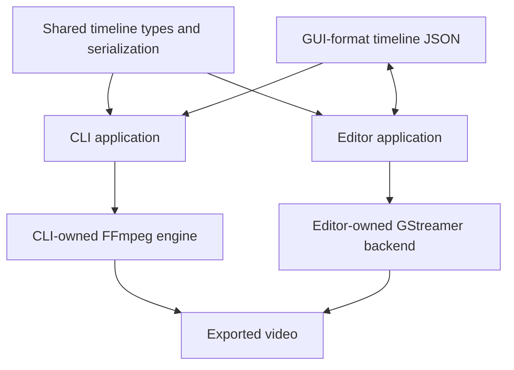
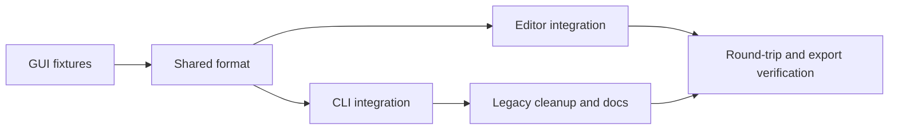
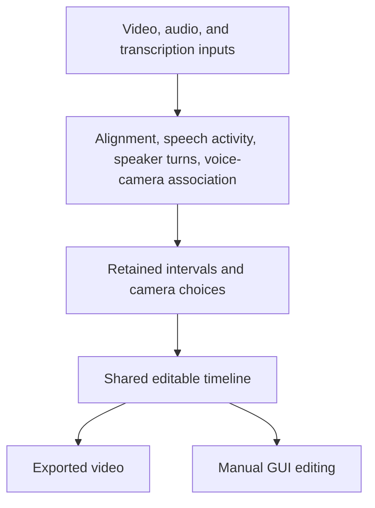

# Shared timeline format, then agent-assisted podcast editing

## Immediate milestone: one timeline format

The CLI and editor use the existing GUI timeline format and the same Rust
serialization types. The CLI exports through FFmpeg; the editor edits and exports
through GStreamer. Legacy CLI format compatibility is intentionally removed.

Top-level modules are applications (`cli`, `editor`, `player`) or shared components
(`timeline`, `video`, `video2`). There is no generic `core` layer or top-level
FFmpeg engine. Application-specific helpers stay beneath their application.
The shared [timeline module](../timeline/mod.rs) contains document representation,
serialization rules, and the time/accessor semantics of that representation. It
contains no filesystem I/O, renderer state, or GStreamer editing operations.

The immediate task is format unification. It does not add a shared editing API,
agent assembly commands, SRT import to the CLI, or AI analysis. Whether an agent
writes JSON directly or invokes assembly commands will be decided separately.

## Modules and interfaces

| Owner | Responsibility |
| --- | --- |
| `timeline` | GUI document/settings/assets/tracks/clips/view types, rational frame/time representation, Serde rules and existing GUI aliases, in-memory parsing and parse errors. |
| `cli` | File loading, validation/reporting, atomic output, schema command, media probing, rendering options, and its FFmpeg engine. |
| `editor` | File loading/saving, GUI repair policy, edits, history, interactive state, existing SRT import, GStreamer playback/export. |
| `player`, `video`, `video2` | Existing application/backend responsibilities; no changes required for this milestone. |

Features expose the shared format without either backend. `timeline-schema` adds
JSON Schema generation; `cli` and `editor` depend on the shared format. Applications
render the same document directly, without a permanent two-format conversion bridge.

The format retains GUI clip tags (`kind`/`data`), ULIDs, asset metadata, integer
frame positions/source bounds, duration-based text lengths, pixel-offset video
transforms, normalized text positions, and view state. Video visibility and audio
muting are independent. Earlier tracks have higher visual priority, with text
above video. Locking and view state do not affect rendering.

Relative asset paths resolve from the project root. CLI `--project-root` defaults
to the working directory; nested timeline files do not change that base. Original
media must remain available for editing/export. Existing valid GUI documents keep
their supported content and semantics; old CLI documents fail explicitly.

## Priorities, tasks, and dependencies

| ID | Priority | Task | Depends on | Acceptance |
| --- | --- | --- | --- | --- |
| F1 | P0 | Capture representative GUI-format fixtures. | — | Video, audio, image, text, transforms, track flags, fractional rate, and view state are represented. |
| F2 | P0 | Extract shared types and serialization without I/O/backend dependencies. | F1 | Standalone format build and round-trip tests pass. |
| F3 | P0 | Rewire editor to shared types; keep editor-owned operations and persistence. | F2 | Existing timeline/editing tests and GUI build pass. |
| F4 | P0 | Adapt CLI commands, validation, and FFmpeg renderer to shared types. | F2 | CLI accepts GUI files; timing, layering, transforms, and audio flags match the contract. |
| F5 | P0 | Remove legacy CLI model/edit/effect code and refresh schema/docs. | F4 | No second document format; legacy inputs produce explicit errors. |
| F6 | P0 | Verify saved-file round trips and both backend exports. | F3, F4, F5 | Open/edit/save in GUI and render that file through CLI; compare source/timing/audio/geometry. |

## Verification

Implemented F1–F6: shared types, both integrations, legacy cleanup, and the synthetic
round-trip/export test. The editor now renders text on independent transparent
title layers, so source transforms do not scale or reposition captions. Backend
frame boundaries and ARGB text colors are covered by the integration checks.

The selected editor regression run passes 89 tests. Five existing GES editing
tests are excluded after a synchronous-commit stall, and four platform export
tests remain outside the headless run. Hardware export verification remains pending.

- Preserve all supported GUI fields through serialization; keep existing GUI aliases.
- Validate missing references, malformed field types, overlapping clips, and legacy CLI input.
- Exercise nonzero trims, fractional/mixed frame rates, image duration, gaps, and text cue boundaries.
- Check layer order, pixel transforms, hidden-video audio, track/clip mute, and lock independence.
- Verify absolute and project-relative paths, including nested timeline files.
- Save from the GUI, change a cut and caption, save again, and render that exact document through both backends.
- Compare duration, camera/content selection, audible tracks, and placement. Font rasterization and encoded bytes need not be identical.
- Build the format without media dependencies, CLI without GUI dependencies, and editor without the CLI feature.
- Link vendored FFmpeg; never build FFmpeg or include Python in the build.

## Deferred podcast workflow

The broader vision still produces an exported podcast and an editable timeline
from two participant camera recordings, one master/shared audio track, and
transcription. The next interface should build a shared timeline from explicitly
supplied decisions before automatic analysis is integrated.

| Future priority | Work | Prerequisites |
| --- | --- | --- |
| P1 | Choose direct JSON authoring versus CLI assembly commands; add SRT-to-text assembly as appropriate. | Shared-format milestone. |
| P1 | Define retained-interval mapping and compile video, master audio, and retimed captions from supplied decisions. | Authoring interface. |
| P1 | Integrate timestamped transcription, diarization, and speech activity through replaceable workers. | Analysis contracts and media preparation. |
| P1 | Align recordings and associate visible speakers with voices, including a silent second camera. | Media samples, speaker turns, synchronization evidence. |
| P2 | Add automatic conservative pause/camera policy, robust two-hour jobs, and measured performance improvements. | Compilation plus verified analysis. |
| P2 | Extend supported recordings to drift correction and richer editorial behavior. | End-to-end quality and resource tests. |

SRT is a caption interchange artifact, not a sufficient speaker-analysis contract.
Retain structured word/speaker timestamps and retime captions after cuts. Use one
master audio source independent of camera switches. Uncertain synchronization or
voice-to-camera association must produce an actionable finding rather than a
silent guess. These decisions are outside the immediate format-unification work.
