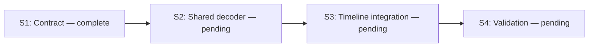

# Accelerate timeline decoding

Preserve `VideoReader::at(seconds) -> Result<RgbaImage>` and nearest-frame
selection while reducing intermediate decode/output work and enabling the
existing macOS VideoToolbox path for supported media. Keep decoding on workers.
Hardware support initially follows the existing backend's supported 8-bit
H.264/HEVC MP4/MOV inputs; other platforms and unsupported inputs use software.
This does not introduce GPU color conversion or change timeline compositing.

## Progress

1/4 active steps complete. Current: S1 review. Blockers: none.
Each implementation step requires user review before the next step.

## Steps

- [x] **S1 — Trace and define the decoding contract** (complete; no dependencies).
  Inspect timeline decoding and existing hardware seek suppression. Preserve
  nearest-frame accuracy, color, rotation, and EOF behavior. Evidence:
  `engine/decode.rs` currently converts every decoded frame; the existing
  `video2/decompression` backend supports VideoToolbox, seek-target output
  suppression, and eligible non-reference picture skipping.
- [ ] **S2 — Share hardware-capable decompression** (pending; depends on S1).
  Move the decompression module out of the playback-only module into a shared
  library module available to engine and playback feature configurations.
  Update playback imports and Cargo feature dependencies for macOS frameworks.
  Preserve its decoding behavior; check editor, CLI, and player configurations
  against existing vendored FFmpeg. Do not build FFmpeg or add new tests.
- [ ] **S3 — Integrate target-aware decoding into VideoReader** (pending; depends on S2).
  Use shared decompression with hardware preferred for supported inputs and
  software fallback when hardware initialization is unavailable. On hardware
  decode failure, reopen in software and retry the requested position once;
  propagate failure if software also fails. Pass seek targets in stream time
  units. Preserve frames bracketing the target; skip only intermediate pictures
  proven unnecessary, never globally enable NONREF for accurate target output.
  Retain decoded frames until selection, then convert only the selected frame
  to RGBA, preserving color-range handling and rotation. Initialize/reconfigure
  the scaler from actual output frame format and dimensions (including NV12).
  Keep cached selected images reusable and keep the existing elapsed-time log.
  Evidence: reviewed control flow for forward, backward, repeated, EOF, and
  fallback requests; editor/CLI/player builds pass.
- [ ] **S4 — Validate correctness and timing** (pending; depends on S3).
  Run existing decode and timeline backend tests; add no tests. Compare the
  reported forward/backward seek sequence on the same media using existing
  timing instrumentation, recording whether hardware was selected. Verify
  target frames, color, rotation, EOF, and software fallback using existing
  fixtures or manual checks. Record actual timing and any unverified cases;
  do not claim a speedup from build results alone.

All steps are sequential; no independent parallel steps.

